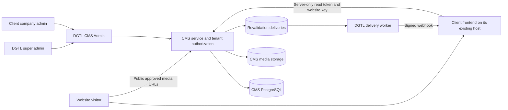

# DGTL CMS — Future Client Website Connection Roadmap

Version: 1.0 • Prepared: 10 September 2026

Audience: DGTL management, super admins, frontend developers, CMS developers, DevOps, QA, and client company admins.

Code baseline reviewed: CMS repository commit `b6e679fc50f1906ac6e3fdee677e7ed60de2b797`. The newly forked DGTL360 frontend at commit `41064ac70e5c2be721ec360cb4645eec4b2d9bf8` is a separate, currently unconnected frontend.

This is an implementation and maintenance guide, not a statement that a production deployment or new integration has already been completed. Creating this document does not change application code, create client accounts, provision services, or migrate content. Example domains, accounts, keys, and secrets below are placeholders, not existing production resources.

## Contents

1. [The simple answer](#1-the-simple-answer)
2. [Architecture and responsibilities](#2-architecture-and-responsibilities)
3. [What exists today and what does not](#3-what-exists-today-and-what-does-not)
4. [Roadmap at a glance](#4-roadmap-at-a-glance)
5. [Step 1 — Collect the client handover](#5-step-1--collect-the-client-handover)
6. [Step 2 — Confirm hosting and CMS readiness](#6-step-2--confirm-hosting-and-cms-readiness)
7. [Step 3 — Agree on content and route mappings](#7-step-3--agree-on-content-and-route-mappings)
8. [Step 4 — Create the tenant and website](#8-step-4--create-the-tenant-and-website)
9. [Step 5 — Create the client admin account](#9-step-5--create-the-client-admin-account)
10. [Step 6 — Configure secrets and network access](#10-step-6--configure-secrets-and-network-access)
11. [Step 7 — Add a reusable frontend connection layer](#11-step-7--add-a-reusable-frontend-connection-layer)
12. [Step 8 — Connect existing components and new-page routes](#12-step-8--connect-existing-components-and-new-page-routes)
13. [Step 9 — Connect navigation, social links, media, and SEO](#13-step-9--connect-navigation-social-links-media-and-seo)
14. [Step 10 — Implement publish-to-website updates](#14-step-10--implement-publish-to-website-updates)
15. [Step 11 — Implement controlled page preview](#15-step-11--implement-controlled-page-preview)
16. [Step 12 — Migrate and verify content](#16-step-12--migrate-and-verify-content)
17. [Step 13 — Deploy on the existing frontend host](#17-step-13--deploy-on-the-existing-frontend-host)
18. [Step 14 — QA, release, and rollback](#18-step-14--qa-release-and-rollback)
19. [Step 15 — Train the client admin](#19-step-15--train-the-client-admin)
20. [Repeatable onboarding and future platform improvements](#20-repeatable-onboarding-and-future-platform-improvements)
21. [Maintenance and incident playbook](#21-maintenance-and-incident-playbook)
22. [Troubleshooting](#22-troubleshooting)
23. [DGTL360 new frontend: how to apply this roadmap](#23-dgtl360-new-frontend-how-to-apply-this-roadmap)
24. [Handover template and source references](#24-handover-template-and-source-references)

## 1. The simple answer

**Yes: an existing website hosted on Vercel or another suitable host can connect to DGTL CMS while remaining on its current host. The first connection requires programming plus CMS configuration. After that, routine editing uses the CMS.**

Think of it as two jobs:

- **Developer job, once per frontend implementation:** replace agreed hardcoded content with CMS data, connect images and links, implement routes, preview and cache updates, test, and redeploy the frontend.
- **Administrator job, repeatedly afterward:** enter content, change supported fields, upload approved media, manage menus, and publish.

Entering `www.golab.example` in **Websites** does not inspect the website, modify its GitHub repository, replace its text, change its DNS, or install the connection automatically.

### Example story

GoLab already has a Next.js website on Vercel. Its hero currently says “Welcome to GoLab” inside a React component.

1. The super admin creates GoLab's tenant, website, and client admin account in DGTL CMS.
2. The developer creates a GoLab Home page in the CMS and maps its Hero heading to that React component.
3. DevOps configures a GoLab-specific read token on the CMS and in the Vercel project's server environment.
4. The developer deploys the connected frontend to GoLab's existing Vercel project.
5. GoLab's admin logs into DGTL CMS, changes the heading, previews it, and publishes.
6. The website fetches the new content after its cache is invalidated. A visitor sees it on a new request or refresh.

The client's admin does not need GitHub, Vercel, SSH, database credentials, or coding knowledge for step 5.

### Does every future client need programming?

| Situation | Work needed |
|---|---|
| A different existing frontend with its own components | Integrate and map that frontend's components; reuse the connector and QA process |
| Another site using an already integrated DGTL frontend template | Mostly content, credentials, site binding, deployment configuration, and regression testing |
| Change an already mapped heading, image, or social link | CMS editing only |
| Add a page using already supported blocks and a working catch-all route | CMS editing and navigation configuration; no new page file normally needed |
| Add a new animation system, layout type, or unsupported editable field | Developer work, tests, and a frontend release; sometimes a CMS schema/API release too |
| Connect an arbitrary website only by entering its URL | Not supported by the current platform |

## 2. Architecture and responsibilities



The browser receives rendered content, not the CMS read token. The client frontend does not connect directly to the CMS database. The CMS and frontend may be on different cloud providers.

| Participant | Owns | Does not normally receive |
|---|---|---|
| DGTL super admin | Tenant and website records, client accounts, cross-client administration | Automatic ability to edit frontend source through the CMS |
| Frontend developer | Component mappings, routes, styles, accessibility, caching, preview, frontend deployment changes | CMS database access merely to render content |
| CMS developer | Collection schemas, DTOs, API behavior, tenant isolation, migrations | Authority to change client content without the agreed workflow |
| DevOps/security | Hosting, secrets, TLS, backups, email, monitoring, worker operation, release controls | Permission to expose credentials to the browser |
| QA | Evidence for editing, publishing, routing, isolation, failures, and rollback | A “production approved” conclusion based only on a successful build |
| Client company admin | Content and permitted configuration within assigned tenant(s), own account profile | Other tenants, tenant creation, website binding changes, role assignment, or server secrets |
| Visitor | Published website and intentionally public media | CMS login, draft text, private media, or API credentials |

Current client authorization is **tenant-scoped**, not a configurable per-website membership system. A client admin assigned to a tenant can manage that tenant's content, potentially across multiple websites in that tenant. Use separate tenants when separate company access boundaries are required; do not promise per-website admin isolation within one tenant without implementing it.

## 3. What exists today and what does not

These statements come from the reviewed project code, not generic Payload capabilities.

| Capability | Current implementation / boundary |
|---|---|
| Two human profiles | Super Admin: `accountType=company`, `companyRoles=[company-super-admin]`; Client Company Admin: `accountType=client`, tenant role `client-admin` |
| Client self-signup | No normal public self-service client signup. A super admin creates accounts; anonymous creation is restricted to initial empty-database bootstrap |
| Tenant and website provisioning | Super-admin CMS forms exist; DNS and frontend deployment are separate work |
| Website authentication | Website-specific bearer token plus matching `X-DGTL-Website-Key` header |
| Stable content API | `/api/dgtl/public/v1/sites/{websiteKey}`; DTO `contractVersion` is currently `1` |
| Public API means anonymous access? | No for JSON content endpoints. Public website media is a deliberate anonymous exception |
| Reusable client and schemas | `packages/cms-client` and `packages/content-contracts`; both currently `private: true`, with workspace imports and TypeScript source exports |
| Page creation | CMS can create pages; a frontend route and supported renderer must exist to show them |
| Page list API | Currently only `pages?template=service`, up to 100 results, without general page pagination |
| Blog posts | Published post detail and paginated list APIs exist; the frontend must implement its blog pages |
| Draft page preview | Five-minute signed preview links and reference frontend routes exist |
| Full-site draft preview | Not implemented as a universal draft session for every resource. Page tokens are document-specific; settings/navigation are not draft collections here |
| Publish updates | Durable delivery records plus a separately running worker and a frontend webhook |
| Social links | Site Settings exposes up to 10 valid HTTPS social links; frontend must render them |
| Arbitrary CSS/animation editing | Not provided. Approved fields only affect components wired to use them |
| Fonts and colors | Page typography has `brand`, `sans`, `serif`; `serviceDetail.accent` exists. The Hero DTO currently has no general background-color field |
| Automatic schema compatibility | `contentModelVersion` on Websites is metadata, not an implemented per-client API version negotiation mechanism |
| Client onboarding wizard / connector installer | Not implemented; section 20 is a future development roadmap |

Important existing-reference details:

- `getPage()` returns a **PageDTO directly**: use `page.title` and `page.layout`, not `response.page.title` unless your own adapter deliberately wraps it.
- The current reference webhook uses `revalidateTag(tag, { expire: 0 })`, not the stale-while-revalidate `max` profile.
- Authenticated duplicate webhook deliveries are acknowledged successfully; cache invalidation is idempotent.
- The current preview verifier uses a shared CMS signing secret. Treat this as a security design decision, not a per-client isolated secret system.

## 4. Roadmap at a glance

| Step | Owner | Result required before moving on |
|---|---|---|
| 1. Handover | Project lead + client | Repository/hosting access, route inventory, editable-content agreement |
| 2. Readiness | DevOps + CMS developer | Reachable staged CMS, database, media, worker, and email |
| 3. Mapping | Frontend + CMS developer | Field-to-component and URL-to-slug matrix |
| 4. Tenant/site | Super admin | Correct website key, tenant relationship, origins, status |
| 5. Account | Super admin | Verified client account with only its tenant assignment |
| 6. Secrets/network | DevOps | Matching site credentials, HTTPS connectivity, least privilege |
| 7. Connector | Frontend developer | Server-only, contract-validated content requests |
| 8. Components/routes | Frontend developer | Existing design renders CMS values; new-page routing works |
| 9. Site shell | Frontend developer | Menus, social links, media, metadata connected |
| 10. Publication | Frontend + DevOps | Signed deliveries refresh the correct website |
| 11. Preview | Frontend + security | Draft page preview works without exposing public draft text |
| 12. Content migration | Content team + developer | Agreed content imported and reconciled |
| 13. Hosting release | DevOps + developer | Staging then production frontend deployments |
| 14. QA/sign-off | QA + security + owner | Evidence, rollback rehearsal, acceptance recorded |
| 15. Training | Super admin + client | Client completes the edit/preview/publish exercise independently |

Do not estimate the integration solely from the number of pages. Bespoke animation, data shapes, missing content models, routing, authentication, and migration quality often determine the work.

## 5. Step 1 — Collect the client handover

**Owner:** project lead and frontend developer.

**Do:** obtain permission and enough information to work on the actual hosted project.

- Repository URL, default branch, deployment branch, and a known-good release/commit.
- Framework and version, package manager and lockfile, runtime version, build/start commands, deployment root directory.
- Hosting project/team access through invitations, not by sharing personal passwords.
- Production URL and a staging URL. Record custom domains and redirects.
- List all pages, dynamic route patterns, languages, blogs, forms, and login-protected routes.
- Identify existing backend APIs, payments, analytics, search, and email. Connecting CMS content does not replace those services.
- Inventory image/video files and confirm the client's rights to publish them.
- List what the client must edit: text, images, links, SEO, layout order, approved design choices.
- Record accessibility, SEO, performance, privacy, backup, and content-freshness expectations.
- Save screenshots and representative URLs before any integration changes.

**Example intake:**

```yaml
client: GoLab
tenantKey: golab
websiteKey: golab-main
frontendFamily: golab-nextjs
framework: Next.js App Router
repository: https://github.com/EXAMPLE-ORG/golab-website
productionOrigin: https://www.golab.example
stagingOrigin: https://staging.golab.example
cmsOrigin: https://cms.dgtl.example
requiredRoutes:
  - /
  - /about-us
  - /services/consulting
  - /contact
  - /blog
editableAreas:
  - hero text and media
  - service content
  - navigation and social links
  - page SEO
excludedFromCms:
  - payment processing
  - animation implementation
```

This is an intake template, **not a configuration file that the current CMS automatically imports**.

**Acceptance:** the developer can run the existing frontend unchanged, and the client agrees on what “CMS connected” includes.

## 6. Step 2 — Confirm hosting and CMS readiness

**Owner:** DevOps and CMS developer.

### 6.1 Choose the integration mode

| Existing frontend | Connection approach | Important limitation |
|---|---|---|
| Next.js with Node/server functions, including Vercel | Server Components/server utilities fetch CMS JSON; Next route handlers handle preview and webhooks | Check the actual framework version, cache configuration, and deployment limits |
| Another server-rendered framework | Server-side HTTP adapter using the same API, headers, DTO validation, and signed webhooks | Next-specific examples must be rewritten for that framework |
| Static export / static HTML | Fetch content during a protected build, then rebuild on content changes | No runtime Next Draft Mode, ISR, or POST route handler in static files |
| Browser-only React/Vite SPA | Add a server/backend-for-frontend layer, or generate content at build time | Never place the CMS read token in browser environment variables |
| Edge-only host | Implement and verify a compatible adapter/runtime | This guide's `node:crypto` webhook/preview code targets Node, not a universal Edge runtime |
| Website without source-code/build access | Obtain access or ask its developer to integrate | A domain name alone is insufficient |

Static exports do not support the server features used by the Next.js example; use a server-capable deployment or an explicitly designed build-time integration. [Next.js static export limitations](https://nextjs.org/docs/app/guides/static-exports).

For a static frontend, the CMS worker's current request is a signed DGTL webhook, **not a ready-made Vercel Deploy Hook integration**. Build a trusted webhook receiver that validates the signature, coalesces updates, then invokes a securely stored build hook. Keep a route inventory because this API does not yet list all standard pages. A successful webhook response only confirms receipt; the build/deploy result must also be monitored. Do not point the current worker at an arbitrary build hook and assume complete compatibility.

### 6.2 Verify the CMS environment

- Use a stable HTTPS CMS origin; `https://cms.dgtl.lk` is an example choice only if you configure that actual subdomain.
- Confirm current migrations, database connectivity, backup retention, and a restore test.
- Confirm media storage persists across deployments and public media URLs work externally.
- Confirm the production malware-scanning policy and an approved upload work.
- Run the delivery worker against the same intended CMS database and secret configuration.
- Verify email configuration for verification and password recovery.
- Establish monitoring, request limits, TLS, and access restrictions before customer traffic.
- Keep staging data and credentials separate from production. Do not reuse demo credentials or run the demo seed on production to onboard a real customer.

**Acceptance:** the deployed frontend runtime can reach the CMS; the CMS worker can reach the frontend webhook; an actual media file loads from an external browser. This document alone is not evidence that those conditions hold today.

## 7. Step 3 — Agree on content and route mappings

**Owner:** frontend developer, CMS developer, and content owner.

Create a mapping sheet before changing code. Every item promised as editable must have all four links:

```text
CMS input field → public API field → frontend component prop → visible output
```

### 7.1 Example field mapping

| Website area | Current CMS input | API field | Frontend action |
|---|---|---|---|
| Home hero headline | Pages → Home → Layout → Hero → Heading | `page.layout[n].heading` | Replace the hardcoded headline prop |
| Hero supporting text | Hero → Text | `page.layout[n].text` | Render text while retaining CSS and animation |
| Hero media | Hero → Image / Video | `image.url` / `video.url` | Render returned media URLs with accessible alternatives |
| Service accent | Service Detail → Accent | `serviceDetail.accent` | Apply a validated six-digit hex color to an approved CSS variable |
| Page font treatment | Page typography → Page font | `page.typography.fontFamily` | Map `brand`, `sans`, `serif` to local CSS classes/fonts |
| Footer social links | Site Settings → Social Links | `settings.socialLinks` | Render clickable external links/icons |
| Menus | Navigation → Header/Footer | `navigation.items` | Render URLs, labels, children, and new-tab behavior |
| SEO | Pages → SEO; Site Settings → Default SEO | `page.seo`, `settings.defaultSEO` | Generate metadata and fallback values |
| Rich text | Rich Text block | `content` structured JSON | Use a reviewed rich-text serializer; not raw untrusted HTML |
| New custom animation setting | No automatic field | No automatic DTO field | Implement schema, validation, mapping, renderer, tests, and rollout first |

“Hero color” is not currently a generic Hero DTO field. Tenant branding colors also do not magically change every frontend. Do not tell a client a field is editable until its complete mapping has passed a test.

### 7.2 Supported blocks and design choice

The current contract includes:

`hero`, `richText`, `imageText`, `callToAction`, `cardGrid`, `gallery`, `faq`, `contactDetails`, `logoCloud`, `spacer`, `serviceIndex`, `companyOverview`, `statement`, `teamShowcase`, `serviceDetail`, `identityField`.

Choose one rendering strategy per route:

- **Bespoke route:** keep the existing design, find specific CMS blocks, and pass content to the existing components. Block order in the CMS will not reorder a route that still explicitly renders Hero → Team → Contact in code.
- **Flexible route:** iterate through `page.layout` in its stored order using an approved block renderer. Reordering is supported only for blocks the renderer handles.
- **Hybrid:** bespoke home/service routes plus a generic catch-all for standard pages.

The CMS currently exposes its supported block set globally. A per-frontend capability allowlist in the editor is a future improvement, not an existing enforcement guarantee. Record the allowed blocks for each client, train editors, and treat unsupported selections as a release/test failure.

### 7.3 Preserve URLs

| Existing public URL | Recommended CMS Page slug |
|---|---|
| `/` | `home` |
| `/about-us` | `about-us` |
| `/services/consulting` | `services/consulting` |
| `/contact` | `contact` |

Use lowercase path segments with hyphens. Preserve existing successful URLs. If a URL must change, implement a permanent redirect, update menus and sitemap, and test old inbound links.

The API lookup does not automatically resolve the Website `homepage` relationship when a frontend asks for `home`; the reference frontend explicitly requests the `home` slug. Follow that convention unless implementing and testing another routing contract.

For posts, agree whether a Post slug is `news-item` with a frontend `/blog/news-item` prefix, or already contains the prefix. The worker derives cache paths from slugs. If your route adds a prefix, adapt path mapping and keep the site-wide cache tag on all related fetches.

**Acceptance:** all promised fields and routes have a mapping and a named test. Keep this matrix in the client repository for future maintainers.

## 8. Step 4 — Create the tenant and website

**Owner:** DGTL super admin. **Where:** the CMS Admin, not Vercel.

1. Log into the deployed CMS `/admin/login` with your own super admin account.
2. Open **Dgtl Tenants → Create New**.
3. Enter `key=golab`, `displayName=GoLab`, and the client's contact information. Start in `draft` while provisioning.
4. Select the GoLab tenant in the CMS tenant selector.
5. Open **Websites → Create New** and fill the following fields.

| Field | Example | Explanation |
|---|---|---|
| Tenant | GoLab | Relationship to the correct company; verify it even if preselected |
| Key | `golab-main` | Stable, unique machine identifier; not a password |
| Display Name | `GoLab Website` | Name shown to administrators |
| Status | `draft`, then `active` | JSON reads require active/maintenance website and active tenant |
| Domain | `www.golab.example` | Hostname, no scheme or path; does not configure DNS |
| Preview Domain | `https://staging.golab.example` | Stable full origin of a frontend with preview implemented |
| Frontend Key | `golab-nextjs` | Descriptive frontend family identifier; does not deploy code |
| Content Model Version | `1` | Current binding metadata; see versioning limitations |
| Revalidation URL | `https://www.golab.example/api/cms/revalidate` | Exact endpoint the worker will call |
| Revalidation Secret Ref | `env:CMS_REVALIDATION_SECRETS:golab-main` | Reference string, never the actual secret |
| Homepage | Select Home after creating it | Optional relationship; follow the `home` slug convention too |

6. Create one **Site Settings** record for this Website.
7. Create **Navigation** records for `header` and `footer`, even if initially empty.
8. Create **Pages → Home**, choose this Website, set slug `home`, choose `landing` or `standard`, and add approved blocks.
9. Activate the tenant and website in the test environment when ready to verify API reads. Publish Home for the public-read test.
10. After the Home record exists, return to Websites and assign the Homepage relationship if desired.

The runtime worker currently resolves the secret using the Website key in `CMS_REVALIDATION_SECRETS`. Filling `revalidationSecretRef` alone does not create a secret or configure the worker.

For staging, prefer a separate CMS deployment/database with separate secret values. If using one CMS deployment, use a separate staging tenant/site binding when staged content must not appear on production. Each Website currently has one revalidation destination and one preview origin; multi-environment delivery fan-out is not automatic.

**Acceptance:** the records belong to GoLab, and the Website is retrievable with its matching credentials after step 6.

## 9. Step 5 — Create the client admin account

**Owner:** DGTL super admin. **Where:** **Cms Users → Create New**.

1. Enter the person's display name and real email address, such as `owner@golab.example` in this fictional example.
2. Choose **Client Company Admin** (`accountType=client`), not Super Admin.
3. Add a tenant assignment for **GoLab** with role **Client Company Admin** (`client-admin`). Do not add other tenants.
4. Use the production invitation/verification process. Production enables email verification; an invited account becomes active when the verification update succeeds.
5. If the create form requires a password, set a strong temporary password through a secure process and have the user establish a personal password using the supported recovery flow. Do not email plaintext permanent passwords.
6. Verify that the tenant is active, the account is active after verification, and the user can log in.
7. Test password recovery before handover. Do not promise delivery merely because an email was logged locally.

In local development, verification is not enabled in the same way; an `invited` account still cannot log in until active. Do not confuse that development shortcut with the production process.

The account starts with `status=invited` by default. Login checks the user's status and active tenant assignment. Client admins cannot create other CMS users or change their own role/tenant assignment. The platform also protects the last active client admin for a tenant.

Use two browser profiles or an ordinary and private window when testing super admin and client admin at the same CMS hostname. Two tabs share cookies and are not separate login sessions.

**Acceptance:** GoLab's admin can edit GoLab content and is denied access to another tenant's records, including through direct document URLs/API requests.

## 10. Step 6 — Configure secrets and network access

**Owner:** DevOps. A no-code super admin cannot complete this deployment configuration from the current CMS forms alone.

### 10.1 Credentials are different from human accounts

| Value | CMS/worker location | Frontend location | Purpose |
|---|---|---|---|
| Website key | Websites record | `CMS_WEBSITE_KEY` | Select one website binding |
| Per-site read token | `CMS_WEBSITE_READ_TOKENS[websiteKey]` | `CMS_READ_TOKEN` | Read that website's JSON content |
| Per-site webhook secret | `CMS_REVALIDATION_SECRETS[websiteKey]` | `CMS_REVALIDATION_SECRET` | Authenticate cache-invalidating deliveries |
| Current shared preview signing secret | `CMS_PREVIEW_SIGNING_SECRET` | `CMS_PREVIEW_SECRET`, only where trusted preview is enabled | Validate signed page-preview links |
| CMS URL | `CMS_PUBLIC_URL` | `CMS_URL` | Public CMS origin |
| Frontend URL | Website Domain/Preview Domain | Example adapter's `SITE_URL` | Canonical origin and safe preview redirects |

Never give a frontend `PAYLOAD_SECRET`, CMS database credentials, a super-admin password, or a CMS login session token as its content read credential.

Generate independent high-entropy read and webhook secrets with a secrets manager or a local cryptographic generator. For example, in a private local terminal:

```bash
node -e "console.log(require('node:crypto').randomBytes(32).toString('hex'))"
```

Run it separately for separate secrets. Store results in the approved secret store, not Git, tickets, screenshots, or this document.

### 10.2 CMS deployment environment

Merge GoLab entries into the existing maps, preserving all other customers. The following is a conceptual example, not a replacement for your actual deployment values:

```dotenv
CMS_PUBLIC_URL=https://cms.dgtl.example
CMS_WEBSITE_READ_TOKENS={"existing-site":"<KEEP_EXISTING_VALUE>","golab-main":"<GOLAB_READ_TOKEN>"}
CMS_REVALIDATION_SECRETS={"existing-site":"<KEEP_EXISTING_VALUE>","golab-main":"<GOLAB_WEBHOOK_SECRET>"}
CMS_PREVIEW_SIGNING_SECRET=<EXISTING_APPROVED_SHARED_PREVIEW_SECRET>
```

Provision the needed environment to both CMS and worker, then roll/restart them using your deployment procedure. Do not rotate the shared preview secret casually when onboarding one client; every existing preview verifier depends on it.

### 10.3 Frontend deployment environment

For this guide's example adapter:

```dotenv
CMS_URL=https://cms.dgtl.example
CMS_WEBSITE_KEY=golab-main
CMS_READ_TOKEN=<GOLAB_READ_TOKEN>
CMS_REVALIDATION_SECRET=<GOLAB_WEBHOOK_SECRET>
CMS_PREVIEW_SECRET=<APPROVED_SHARED_PREVIEW_SECRET_IF_PREVIEW_ENABLED>
SITE_URL=https://www.golab.example
CMS_FETCH_CACHE=no-store
```

`CMS_FETCH_CACHE` and `SITE_URL` are variables consumed by this document's example frontend code; they are not new CMS platform features. The existing reference website instead uses `NEXT_PUBLIC_SITE_URL` for its non-secret site origin. Keep naming consistent with whichever implementation you use.

Initially use `no-store` to prove the mapping. After publication hooks pass, use `CMS_FETCH_CACHE=revalidate` for the example's tagged 300-second cache. This is a proposed baseline, not a universal freshness SLA.

For local development, replace origins with your actual ports, use `.env.local`, and confirm it is ignored by Git. Do not use `localhost` in a deployed frontend's CMS URL: that points at the deployment runtime, not your laptop.

### 10.4 Network and cache requirements

- Frontend server → CMS JSON API: HTTPS with the two required authentication headers.
- CMS worker → frontend webhook: HTTPS, allowing the signed POST to reach the handler.
- Browser/Next image optimizer → public CMS media: reachable public URLs without read credentials.
- Preview: a stable trusted frontend origin with the correct environment and functioning cookies.
- Do not open PostgreSQL to the frontend or the public internet for this integration.
- Do not configure a generic CDN “cache everything” rule over authenticated CMS JSON, Admin, preview, or webhook routes.
- The current JSON responses advertise shared-cache headers. Explicitly bypass shared proxy/CDN caching for authenticated JSON endpoints, including preview-token requests; keep public media under a separate deliberate policy. Frontend cache invalidation cannot purge an unrelated upstream CDN automatically.

`CMS_ALLOWED_ORIGINS` is used by the current Payload configuration for **both CORS and CSRF**. Server-to-server content fetching does not require adding every frontend origin there. Only add exact, trusted browser origins if a specific reviewed browser integration needs them. Avoid wildcard Vercel preview domains or untrusted client domains as a general CSRF allowlist. Custom Next route handlers need their own applicable browser CORS behavior; the Payload setting is not proof that every route supports browser access.

### 10.5 Preview trust decision — required security review

Today, distributing `CMS_PREVIEW_SECRET` distributes the same symmetric signing material used by the CMS. This is not equivalent to sharing only a public verification key. A holder can construct signed claims; the current page-read path checks the signature and page/site binding but does not recheck the signing user's current account status on every preview read.

Therefore:

- Enable this mode only on frontend infrastructure controlled by DGTL or explicitly trusted under the security model.
- For independently controlled/untrusted client infrastructure, initially disable draft preview there; published-content integration still works. Agree a trusted preview environment or build a safer preview design before promising draft preview.
- Proposed improvement: per-site signing keys, asymmetric verification, or a CMS-validated short-lived token exchange. These require CMS and frontend implementation and tests; they do not exist merely by naming a new variable.
- Treat signed preview URLs as temporary bearer credentials. Redact query tokens in logs and analytics. Shared-secret rotation invalidates all issued preview URLs.

**Acceptance:** correct site credentials succeed; wrong/missing credentials fail; secrets are absent from browser bundles, and preview trust has an explicit decision.

## 11. Step 7 — Add a reusable frontend connection layer

**Owner:** frontend developer. **Where:** the client's repository, in a reviewed branch such as `codex/golab-cms-integration`.

### 11.1 Reuse strategy

For independent repositories, do not run `npm install @dgtl/cms-client` expecting a public published package. The current packages are private workspace packages; their build scripts typecheck rather than producing a publishable JavaScript distribution.

Options:

1. **Works today:** vendor a reviewed copy of the contract source into the client repository, record its source commit, and use the self-contained server adapter below.
2. **Also possible:** vendor both the contract and SDK source, adapt imports, and wrap the SDK with server-only boundaries, a timeout, and explicit website-binding checks.
3. **Future preferred:** publish versioned, tested packages to a company-controlled registry. Configure read-only build access on each hosting project. Packaging, JavaScript/declaration output, workspace dependency replacement, and compatibility CI must be implemented first.
4. **Inside this monorepo only:** use `workspace:*` dependencies and `transpilePackages` for the two DGTL packages. That is not a shortcut for an unrelated external repository.

The SDK validates DTO shape/version but does not itself enforce an import-time `server-only` boundary or compare every returned `websiteKey` to its configured binding. The example below adds those checks. Do not rely on TypeScript assertions alone.

### 11.2 Copy the current schemas, not a hand-invented DTO

Copy the full source file from the approved CMS commit:

```text
SOURCE in CMS repository:
packages/content-contracts/src/index.ts

DESTINATION in client repository:
src/lib/dgtl/contracts.ts
```

Add a provenance comment with the upstream commit. Preserve applicable license notices and verify dependency compatibility.

Using the client's existing package manager, install the matching validator and server boundary:

```bash
npm install --save-exact zod@4.5.4 server-only@0.0.1
```

Or the equivalent `pnpm add --save-exact ...`. Keep one package manager and commit its lockfile. The Zod version above matches this reviewed contract snapshot; future upgrades must be coordinated, not copied blindly.

Suggested layout:

```text
src/
  lib/dgtl/
    contracts.ts       # Vendored runtime schemas and types
    cms.ts             # Server-only read adapter below
    page.ts            # Route/preview-aware page loader
    signatures.ts      # Preview signature reference, if enabled
  components/cms/
    MarketingHero.tsx
    CMSPageBody.tsx
    CmsNavigation.tsx
    SocialLinks.tsx
  app/
    page.tsx            # Existing home route, adapted
    [...slug]/page.tsx  # Optional standard-page fallback
    api/cms/revalidate/route.ts
    api/cms/preview/route.ts       # Only after preview trust approval
    api/cms/preview/exit/route.ts
```

The complete code examples target Next.js App Router on a Node runtime with the conventional fetch cache model, as used by the reference app. Preserve existing root layouts and routes. If the client enables `cacheComponents`, uses the Pages Router, static export, or Edge, adapt and retest instead of pasting unchanged.

### 11.3 Server-only adapter

Create `src/lib/dgtl/cms.ts` in the client repository:

```ts
import 'server-only'
import { cache } from 'react'
import type { ZodType } from 'zod'
import {
  navigationDTOSchema, pageDTOSchema, pageListDTOSchema,
  postDTOSchema, postListDTOSchema, siteSettingsDTOSchema,
  websiteDTOSchema,
} from './contracts'

export function requiredEnv(name: string): string {
  const value = process.env[name]?.trim()
  if (!value) throw new Error(`Missing server configuration: ${name}`)
  return value
}

export function websiteKey(): string {
  const key = requiredEnv('CMS_WEBSITE_KEY')
  if (!/^[a-z0-9]+(?:-[a-z0-9]+)*$/.test(key)) {
    throw new Error('Invalid CMS website key configuration')
  }
  return key
}

export class CMSReadError extends Error {
  constructor(readonly status: number, readonly requestId?: string) {
    super(`CMS read failed with HTTP ${status}`)
  }
}

export function normalizePageSlug(input: string): string {
  const slug = input.replace(/^\/+|\/+$/g, '') || 'home'
  if (slug.length > 240 || !/^[a-z0-9]+(?:-[a-z0-9]+)*(?:\/[a-z0-9]+(?:-[a-z0-9]+)*)*$/.test(slug)) {
    throw new CMSReadError(404)
  }
  return slug
}

function cmsOrigin(): string {
  const url = new URL(requiredEnv('CMS_URL'))
  const local = ['localhost', '127.0.0.1', '[::1]'].includes(url.hostname)
  if (url.username || url.password || url.search || url.hash || url.pathname !== '/') {
    throw new Error('CMS_URL must be an origin without credentials or a path')
  }
  if (url.protocol !== 'https:' && !(process.env.NODE_ENV !== 'production' && local && url.protocol === 'http:')) {
    throw new Error('CMS_URL must use HTTPS outside local development')
  }
  return url.origin
}

async function read<T>(
  resource: string,
  schema: ZodType<T>,
  tags: string[],
  previewToken?: string,
): Promise<T> {
  const key = websiteKey()
  const headers = new Headers({
    Accept: 'application/json',
    Authorization: `Bearer ${requiredEnv('CMS_READ_TOKEN')}`,
    'X-DGTL-Website-Key': key,
  })
  if (previewToken) headers.set('X-DGTL-Preview-Token', previewToken)
  const cached = !previewToken && process.env.CMS_FETCH_CACHE === 'revalidate'
  const siteTag = `cms:site:${key}`
  const cacheTags = [...new Set([siteTag, ...tags])].filter(tag => tag.length <= 256)
  const response = await fetch(
    `${cmsOrigin()}/api/dgtl/public/v1/sites/${encodeURIComponent(key)}${resource}`,
    {
      headers,
      redirect: 'error',
      signal: AbortSignal.timeout(8000),
      ...(cached
        ? { cache: 'force-cache' as const, next: { revalidate: 300, tags: cacheTags } }
        : { cache: 'no-store' as const }),
    },
  )
  if (!response.ok) {
    throw new CMSReadError(response.status, response.headers.get('x-request-id') ?? undefined)
  }
  const result = schema.safeParse(await response.json())
  if (!result.success) throw new CMSReadError(502)
  const data = result.data
  const binding = data as { key?: string; websiteKey?: string }
  if ((binding.websiteKey ?? binding.key) !== key) throw new CMSReadError(502)
  return data
}

export const getPage = cache(async (input: string, previewToken?: string) => {
  const slug = normalizePageSlug(input)
  const encoded = slug.split('/').map(encodeURIComponent).join('/')
  return read(`/pages/${encoded}`, pageDTOSchema,
    [`cms:site:${websiteKey()}:pages:${slug}`], previewToken)
})

export const getShell = cache(async () => {
  const tag = `cms:site:${websiteKey()}`
  const [website, settings, header, footer] = await Promise.all([
    read('', websiteDTOSchema, [tag]),
    read('/settings', siteSettingsDTOSchema, [`${tag}:site-settings`]),
    read('/navigation/header', navigationDTOSchema, [`${tag}:navigation`]),
    read('/navigation/footer', navigationDTOSchema, [`${tag}:navigation`]),
  ])
  return { website, settings, header, footer }
})

export const getServicePages = cache(async () => {
  const result = await read('/pages?template=service', pageListDTOSchema,
    [`cms:site:${websiteKey()}`])
  if (result.pages.some(page => page.websiteKey !== websiteKey())) throw new CMSReadError(502)
  return result.pages
})

export const getPost = cache(async (input: string) => {
  const slug = normalizePageSlug(input)
  return read(`/posts/${slug.split('/').map(encodeURIComponent).join('/')}`,
    postDTOSchema, [`cms:site:${websiteKey()}:posts:${slug}`])
})

export const getPosts = cache(async (page = 1, limit = 12) => {
  if (!Number.isInteger(page) || page < 1 || page > 10000 ||
      !Number.isInteger(limit) || limit < 1 || limit > 50) {
    throw new RangeError('Invalid CMS post pagination')
  }
  const result = await read(`/posts?page=${page}&limit=${limit}`, postListDTOSchema,
    [`cms:site:${websiteKey()}`])
  if (result.posts.some(post => post.websiteKey !== websiteKey())) throw new CMSReadError(502)
  return result
})
```

Why this matters:

- Importing `server-only` prevents accidental use of the adapter in a client bundle.
- The website binding is deployment configuration, never selected from a visitor's query string.
- Runtime schemas check DTO version and shape; explicit binding checks add defense against wrong-site responses.
- Slugs are restricted to the agreed routing convention and encoded as path segments.
- The timeout bounds CMS dependency waiting. Do not add unbounded automatic retries to every visitor request.
- Failures do not silently fall back to demo content. Add a customer-friendly error boundary and safe operational logs without request headers/secrets.
- Draft reads explicitly avoid persistent caching. The site-wide tag covers shell and dependent page relationships.

The `cache()` wrapper is render-pass memoization, not your publish-update mechanism. Persistent fetch caching and tags are separate. [Next.js fetch cache reference](https://nextjs.org/docs/app/api-reference/functions/fetch).

### 11.4 API reference for other languages/frameworks

Base: `{CMS_URL}/api/dgtl/public/v1/sites/{websiteKey}`.

JSON reads require:

```http
Accept: application/json
Authorization: Bearer <SERVER_ONLY_READ_TOKEN>
X-DGTL-Website-Key: golab-main
```

| Method | Relative path | Result |
|---|---|---|
| GET | empty path | WebsiteDTO with `key` |
| GET | `/settings` | SiteSettingsDTO with `websiteKey` |
| GET | `/navigation/header` or `/navigation/footer` | NavigationDTO |
| GET | `/pages/home` | PageDTO directly |
| GET | `/pages/services/consulting` | PageDTO for nested slug |
| GET | `/pages?template=service` | `{contractVersion, websiteKey, pages}`; at most 100 |
| GET | `/posts?page=1&limit=12` | PostListDTO with pagination; limit 1–50 |
| GET | `/posts/{slug}` | Published PostDTO |
| GET | `/media/{mediaID}` | Public approved file bytes; intentionally no bearer token required |

There is no documented generic `/pages?limit=...` list for all page templates here. Do not invent endpoints from the raw Payload collection API and give the public frontend an admin credential to make them work.

The CMS deliberately returns 404 for bad read credentials, mismatched key headers, inactive/suspended bindings, and many missing-resource cases. A 404 does not by itself prove that the content record is missing.

Example successful PageDTO (illustrative data, not a real customer response):

```json
{
  "contractVersion": 1,
  "id": "101",
  "websiteKey": "golab-main",
  "slug": "home",
  "title": "GoLab Home",
  "layout": [{ "blockType": "hero", "heading": "Welcome to GoLab", "text": "Build with us.", "links": [] }],
  "typography": { "fontFamily": "brand" },
  "seo": { "metaTitle": "GoLab", "metaDescription": null, "noIndex": false, "ogImage": null },
  "publishedAt": "2026-09-10T08:00:00.000Z",
  "updatedAt": "2026-09-10T08:00:00.000Z"
}
```

### 11.5 Run a credential-safe connection smoke test

Create `scripts/check-cms.mjs` in the client repository. This only makes read requests; it does not create or edit CMS records. Run it first against staging after creating/publishing Home and Site Settings.

```js
import assert from 'node:assert/strict'

const required = name => {
  const value = process.env[name]?.trim()
  if (!value) throw new Error(`Missing ${name}`)
  return value
}
const origin = new URL(required('CMS_URL'))
const local = ['localhost', '127.0.0.1', '[::1]'].includes(origin.hostname)
assert(origin.protocol === 'https:' || (local && origin.protocol === 'http:'), 'Use HTTPS outside localhost')
assert(!origin.username && !origin.password && !origin.search && !origin.hash && origin.pathname === '/', 'CMS_URL must be an origin')
const key = required('CMS_WEBSITE_KEY')
const token = required('CMS_READ_TOKEN')
const base = `${origin.origin}/api/dgtl/public/v1/sites/${encodeURIComponent(key)}`

async function request(path, credential = token) {
  return fetch(`${base}${path}`, {
    headers: { Accept: 'application/json', Authorization: `Bearer ${credential}`, 'X-DGTL-Website-Key': key },
    cache: 'no-store', redirect: 'error', signal: AbortSignal.timeout(8000),
  })
}

for (const path of ['', '/pages/home', '/settings', '/navigation/header', '/navigation/footer']) {
  const response = await request(path)
  assert.equal(response.status, 200, `Unexpected status for ${path || 'website binding'}`)
  const data = await response.json()
  assert.equal(data.contractVersion, 1, 'Unsupported contract version')
  assert.equal(data.websiteKey ?? data.key, key, 'Wrong website binding')
  console.log(`PASS ${path || 'website binding'}`)
}
const denied = await request('/pages/home', 'deliberately-invalid-smoke-test-token')
assert.equal(denied.status, 404, 'Invalid credentials must not return protected content')
console.log('PASS invalid credentials denied; no credential values printed')
```

From the client repository, with Node 22 and an ignored local environment file:

```bash
node --env-file=.env.local scripts/check-cms.mjs
```

In hosted CI, inject secrets through the environment and use `node scripts/check-cms.mjs`; do not commit the environment file. This is a connectivity/binding smoke test, not a substitute for the adapter's full schema validation or two-tenant QA. A failure with an invalid credential may expose an incorrectly configured upstream cache: stop and investigate, rather than suppressing the assertion.

**Acceptance:** from a server environment, verify Website, Home, Settings, and Navigation return the expected website key/version. Test a wrong-token pairing without exposing credentials in logs.

## 12. Step 8 — Connect existing components and new-page routes

**Owner:** frontend developer. This is the part that makes the website genuinely editable.

### 12.1 A page loader with an explicit preview scope

Create `src/lib/dgtl/page.ts`. This works for published reads even before the preview endpoints are implemented:

```ts
import 'server-only'
import { cache } from 'react'
import { cookies, draftMode } from 'next/headers'
import { notFound } from 'next/navigation'
import { CMSReadError, getPage, normalizePageSlug } from './cms'

export const loadPage = cache(async (input: string) => {
  try {
    const slug = normalizePageSlug(input)
    const draft = await draftMode()
    const jar = await cookies()
    const previewToken = draft.isEnabled && jar.get('dgtl-preview-slug')?.value === slug
      ? jar.get('dgtl-preview-token')?.value
      : undefined
    return { page: await getPage(slug, previewToken), isPreview: Boolean(previewToken) }
  } catch (error) {
    if (error instanceof CMSReadError && error.status === 404) notFound()
    throw error
  }
})
```

The extra slug cookie is an example integration addition: it keeps a preview token for Home from being sent when the editor navigates to another page. It is not a new authorization mechanism; the CMS still verifies the signed token and actual page/site binding. Invalid/expired preview tokens must fail visibly; generate a new link or exit preview rather than silently showing published content as a draft.

### 12.2 Connect a bespoke hero without replacing the design

Create or adapt `src/components/cms/MarketingHero.tsx`:

```tsx
import Image from 'next/image'
import type { PageBlock } from '@/lib/dgtl/contracts'

type HeroContent = Extract<PageBlock, { blockType: 'hero' }>

export function MarketingHero({ content }: { content: HeroContent }) {
  return (
    <section className="existing-hero-design">
      {content.eyebrow && <p>{content.eyebrow}</p>}
      <h1>{content.heading}</h1>
      {content.text && <p>{content.text}</p>}
      {content.image && (
        <Image src={content.image.url} alt={content.image.alt}
          width={content.image.width ?? 1200} height={content.image.height ?? 800}
          sizes="(max-width: 768px) 100vw, 50vw" />
      )}
    </section>
  )
}
```

Example replacement in an existing `src/app/page.tsx`:

```tsx
import { MarketingHero } from '@/components/cms/MarketingHero'
import { loadPage } from '@/lib/dgtl/page'

export default async function HomePage() {
  const { page } = await loadPage('home')
  const hero = page.layout.find(block => block.blockType === 'hero')
  if (!hero || hero.blockType !== 'hero') throw new Error('Home requires a Hero block')
  return <MarketingHero content={hero} />
}
```

This is a minimal example, not a complete replacement for GoLab's existing home page. Preserve its other sections and map each agreed field. The example does not render Hero links/video; those remain unfinished until explicitly mapped and tested. If the real Hero has `'use client'` for animation, keep it a synchronous client component and fetch in the server parent; pass serializable content props, never credentials.

### 12.3 Support new standard pages

If an existing root `app/page.tsx` must stay, add `src/app/[...slug]/page.tsx` for additional standard pages. Do not add a conflicting optional `[[...slug]]` root route without restructuring the existing root. Specific existing routes, including `/services/[slug]`, must be connected separately; a catch-all does not override them.

Create a renderer. The minimal example below supports only **Hero, Image/Text, FAQ, and Spacer**, so restrict the initial acceptance scope to those blocks. For the full platform set, adapt the existing `apps/website/src/components/BlockRenderer.tsx` and `RichText.tsx`, their styling, and dependencies; review the result against the client's design. Merely copying a file is not a visual acceptance test.

`src/components/cms/CMSPageBody.tsx`:

```tsx
import Image from 'next/image'
import type { PageBlock } from '@/lib/dgtl/contracts'

export function CMSPageBody({ blocks }: { blocks: PageBlock[] }) {
  return blocks.map((block, index) => {
    const key = block.id ?? `${block.blockType}-${index}`
    switch (block.blockType) {
      case 'hero':
        return <section key={key}><h2>{block.heading}</h2>{block.text && <p>{block.text}</p>}</section>
      case 'imageText':
        return <section key={key} data-alignment={block.alignment}>
          <h2>{block.heading}</h2><p>{block.text}</p>
          {block.image && <Image src={block.image.url} alt={block.image.alt}
            width={block.image.width ?? 1000} height={block.image.height ?? 750}
            sizes="(max-width: 768px) 100vw, 50vw" />}
        </section>
      case 'faq':
        return <section key={key}>{block.items.map((item, i) =>
          <details key={i}><summary>{item.question}</summary><p>{item.answer}</p></details>
        )}</section>
      case 'spacer':
        return <div key={key} aria-hidden="true" style={{ height: { small: 16, medium: 32, large: 64 }[block.size] }} />
      default:
        throw new Error(`Renderer not implemented for CMS block: ${block.blockType}`)
    }
  })
}
```

This intentionally fails visibly for unsupported blocks instead of pretending everything is connected. It is a teaching renderer: add approved CSS for `data-alignment`, map all promised Hero media/link fields, and implement the remaining promised blocks before launch. Ensure one meaningful H1 and a valid heading hierarchy in the final design.

`src/app/[...slug]/page.tsx`:

```tsx
import type { Metadata } from 'next'
import { CMSPageBody } from '@/components/cms/CMSPageBody'
import { loadPage } from '@/lib/dgtl/page'
import { getShell } from '@/lib/dgtl/cms'

type Props = { params: Promise<{ slug: string[] }> }

export async function generateMetadata({ params }: Props): Promise<Metadata> {
  const { slug } = await params
  const [{ page, isPreview }, { settings }] = await Promise.all([
    loadPage(slug.join('/')), getShell(),
  ])
  const og = page.seo.ogImage ?? settings.defaultSEO.socialImage
  return {
    title: page.seo.metaTitle ?? page.title,
    description: page.seo.metaDescription ?? settings.defaultSEO.description ?? undefined,
    robots: isPreview || page.seo.noIndex ? { index: false, follow: false } : undefined,
    openGraph: og ? { images: [{ url: og.url, alt: og.alt }] } : undefined,
  }
}

export default async function StandardPage({ params }: Props) {
  const { slug } = await params
  const { page, isPreview } = await loadPage(slug.join('/'))
  const font = { brand: 'font-brand', sans: 'font-sans', serif: 'font-serif' }[page.typography.fontFamily]
  return <main className={font}>
    {isPreview && <aside>Draft preview — not public.
      <form method="post" action="/api/cms/preview/exit"><button type="submit">Exit preview</button></form>
    </aside>}
    <h1>{page.title}</h1>
    <CMSPageBody blocks={page.layout} />
  </main>
}
```

Define the approved `font-brand`, `font-sans`, and `font-serif` classes in the existing stylesheet and load the chosen fonts. The CMS selects a token; it does not download arbitrary fonts. Do not add `dynamicParams=false` or a hardcoded static route list that prevents future CMS pages from resolving. If the client uses such settings, adapt and test its exact routing model.

Add a friendly `error.tsx` and `not-found.tsx` consistent with the website. Log only safe status/request IDs on server failures. If a fallback is commercially required, use a monitored last-known-good snapshot for the same website, not unrelated demo content. Suspension, removal, and privacy requirements need an explicit cache-purge policy; stale fallback must not defeat them.

**Acceptance exercise:** create GoLab “About Us”, slug `about-us`, using supported blocks; publish; open `/about-us` directly; change its heading/font; publish again; verify the visible result. Then test an unsupported block deliberately in staging and record the expected safe failure.

## 13. Step 9 — Connect navigation, social links, media, and SEO

**Owner:** frontend developer plus content owner.

### 13.1 Navigation is separate from page rendering

Publishing a page and showing a menu link are separate concerns:

1. A frontend route must render the page's slug.
2. The page must be published, not archived, and bound to this website.
3. The menu must use the CMS Navigation DTO.
4. Add the page relationship to the correct Navigation record, **or** enable `Show In Navigation` for the current automatic-menu behavior.

The API merges opted-in published pages into header navigation, with manually configured URLs taking precedence. A manually configured disabled link reserves its URL and can intentionally suppress an automatic duplicate. Footer links should be curated in the Footer Navigation record; verify the exact endpoint behavior rather than assuming both menus automatically include all pages.

`src/components/cms/CmsNavigation.tsx`:

```tsx
import type { NavigationDTO } from '@/lib/dgtl/contracts'

function safeHref(value: string): string | null {
  if (/^\/(?!\/)[^\s\\]*$/.test(value) || /^(mailto|tel):[^\s]+$/i.test(value)) return value
  try {
    const url = new URL(value)
    return url.protocol === 'https:' && !url.username && !url.password ? url.href : null
  } catch { return null }
}

export function CmsNavigation({ navigation }: { navigation: NavigationDTO }) {
  return <nav aria-label={`${navigation.location} navigation`}><ul>
    {navigation.items.map((item, index) => {
      const href = safeHref(item.url)
      if (!href) return null
      return <li key={`${href}-${index}`}>
        <a href={href} target={item.newTab ? '_blank' : undefined}
          rel={item.newTab ? 'noopener noreferrer' : undefined}>{item.label}</a>
        {item.children.length > 0 && <ul>{item.children.map((child, childIndex) => {
          const childHref = safeHref(child.url)
          return childHref ? <li key={`${childHref}-${childIndex}`}>
            <a href={childHref} target={child.newTab ? '_blank' : undefined}
              rel={child.newTab ? 'noopener noreferrer' : undefined}>{child.label}</a>
          </li> : null
        })}</ul>}
      </li>
    })}
  </ul></nav>
}
```

Use `const { header, footer } = await getShell()` in the existing server layout/shell and pass each DTO to the appropriate menu. Preserve mobile-menu interactions and accessibility; this example is semantic markup, not a styled dropdown implementation.

### 13.2 Social media links

In **Site Settings → GoLab Website → Social Links**, add labels and full real HTTPS URLs:

| Label | Example shape — replace with the client's verified destination |
|---|---|
| Facebook | `https://www.facebook.com/CLIENT_PAGE` |
| YouTube | `https://www.youtube.com/@CLIENT_CHANNEL` |
| LinkedIn | `https://www.linkedin.com/company/CLIENT_COMPANY/` |
| WhatsApp | `https://wa.me/INTERNATIONAL_DIGITS` |

For WhatsApp, use the client's actual international number digits; do not include a plus sign or formatting in the path. Verify the destination manually with the client. HTTP-only and unsafe URLs are filtered from the current public settings mapper.

`src/components/cms/SocialLinks.tsx`:

```tsx
import type { SiteSettingsDTO } from '@/lib/dgtl/contracts'

export function SocialLinks({ links }: { links: SiteSettingsDTO['socialLinks'] }) {
  return <ul aria-label="Social media">
    {(links ?? []).map(link => <li key={`${link.label}-${link.url}`}>
      <a href={link.url} target="_blank" rel="noopener noreferrer">{link.label}</a>
    </li>)}
  </ul>
}
```

Pass `settings.socialLinks` from `getShell()` into the footer. Add a fixed, approved label-to-icon mapping if the client wants branded icons, with the label as the accessible name and a text fallback for unknown labels. Do not rely on decorative icons alone.

Site Settings and Navigation are not draft-enabled in this project. Saving a settings/menu change can enqueue updates immediately. Do not teach the client that these records have the same Save Draft/Publish workflow as Pages.

**Acceptance:** change one social URL in the CMS, save, wait for successful delivery, reload the public website in a visitor session, and confirm the link destination changed. Test only verified harmless destinations; do not send WhatsApp messages as part of the link test.

### 13.3 Media

1. Upload the file to **Media**, assigned to the right tenant and Website.
2. Set correct alt text or mark it decorative according to its real use.
3. Set classification `public` only for assets intended to be publicly retrievable.
4. Wait for `scanStatus=clean`. Pending/rejected media must not be presented as successfully published.
5. Select that Media record in a mapped field; publish the Page if editing page content.
6. Use the returned DTO URL exactly, including the checksum query parameter when present.

The normal mapped URL is:

```text
https://cms.dgtl.example/api/dgtl/public/v1/sites/golab-main/media/123?v=FILE_CHECKSUM
```

Do not construct bucket keys or raw Payload media paths in the frontend. Do not append a read token to an image/video URL. The website-scoped media endpoint checks active tenant/site, matching Website, `public` classification, and `clean` scan status; approved files are deliberately accessible to visitors.

**Public media is not confidential just because the page referencing it is a draft.** This endpoint is not a draft-only private asset delivery system. Sensitive pre-release assets need a separately designed protected preview-media flow.

Merge a narrow remote pattern into the client's existing `next.config.ts` (do not replace unrelated settings):

```ts
import type { NextConfig } from 'next'

const nextConfig: NextConfig = {
  images: {
    remotePatterns: [{
      protocol: 'https',
      hostname: 'cms.dgtl.example',
      pathname: '/api/dgtl/public/v1/sites/golab-main/media/**',
    }],
  },
}
export default nextConfig
```

Replace the hostname and website key for the actual environment. Do not set `search: ''` if checksum query strings must be allowed. For local-only image tests, the exact localhost origin/port may need an explicitly development-only local-IP allowance in the installed Next.js version; never carry that permissive setting into production. On static export, use a compatible image loader or unoptimized images rather than assuming the server optimizer exists.

For videos, use the returned URL in a `<video controls preload="metadata">` or the existing reviewed animation component. Test byte-range playback, fallbacks, keyboard controls, bandwidth, and reduced motion. Editable form labels or video links do not implement the actual form backend or media processing.

### 13.4 Metadata and discoverability

- Merge page SEO with Site Settings defaults, as in the route example.
- Use the actual client origin for canonical URLs; never emit localhost canonicals in production.
- Set `metadataBase` in the existing root layout as appropriate.
- Update sitemap and robots behavior, including excluded/private/no-index pages.
- There is currently no complete all-page listing API. A sitemap based only on Navigation misses pages that are intentionally outside menus. Maintain an approved route manifest or implement a paginated, tenant-bound page-list/sitemap endpoint before promising automated complete discovery.
- Test social share images, favicons, contact details, maintenance messages, locale, and timezone if they are in the agreement. A DTO field existing is not proof that the frontend uses it.

**Acceptance:** the agreed menu, social, media, and SEO fields visibly change on the correct site; the old hardcoded values are no longer used for those fields.

## 14. Step 10 — Implement publish-to-website updates

**Owner:** frontend developer and DevOps.

### 14.1 What “live” means

```text
Client publishes a Page / saves Site Settings or Navigation
  → CMS creates a Revalidation Delivery in its database
  → Running worker sends a signed POST to the Website revalidation URL
  → Frontend validates it and invalidates its CMS cache entries
  → Next website request fetches fresh data and renders it
```

This is not an automatic redeployment of application code and not a WebSocket that changes every already-open visitor tab. Reload or navigate to see the new content. A live-refresh editor experience would be an additional feature.

The current worker retries failed deliveries on a bounded schedule: initial attempt, then approximately 30, 120, 600, and 1800 seconds between retry scheduling steps, up to five attempts. Each outbound request has a 10-second timeout. Monitor the actual delivery status rather than promising an exact instant-update time.

### 14.2 Use the current webhook reference or the compatible example

Current files to review when porting:

```text
apps/website/src/app/api/cms/revalidate/route.ts
apps/website/src/lib/signatures.ts
apps/cms/src/jobs/revalidation.ts
apps/cms/src/hooks/content.ts
```

The current reference keeps bounded duplicate receipts in process memory. They do not persist across serverless instances or restarts. Since its only effect is cache invalidation, authenticated duplicate requests can safely be acknowledged with 200. Do not describe the memory map as a globally reliable replay store.

The following standalone Node handler is a **new integration example**, wire-compatible with the current worker. It bounds request-body reads and deliberately handles retries by allowing idempotent invalidation, without pretending to provide durable exactly-once processing.

Create `src/app/api/cms/revalidate/route.ts`:

```ts
import { createHmac, timingSafeEqual } from 'node:crypto'
import { revalidatePath, revalidateTag } from 'next/cache'
import { requiredEnv, websiteKey } from '@/lib/dgtl/cms'

export const runtime = 'nodejs'
const reply = (body: object, status = 200) =>
  Response.json(body, { status, headers: { 'Cache-Control': 'no-store' } })

async function boundedBody(request: Request): Promise<string | null> {
  const reader = request.body?.getReader()
  if (!reader) return ''
  const chunks: Uint8Array[] = []
  let size = 0
  while (true) {
    const { done, value } = await reader.read()
    if (done) break
    size += value.byteLength
    if (size > 16384) { await reader.cancel(); return null }
    chunks.push(value)
  }
  return Buffer.concat(chunks).toString('utf8')
}

export async function POST(request: Request) {
  const rawBody = await boundedBody(request)
  if (rawBody === null) return reply({ error: 'Body too large' }, 413)
  const timestamp = request.headers.get('x-dgtl-timestamp') ?? ''
  const deliveryId = request.headers.get('x-dgtl-delivery-id') ?? ''
  const signature = request.headers.get('x-dgtl-signature') ?? ''
  const seconds = Number(timestamp)
  if (!/^\d+$/.test(timestamp) || !Number.isSafeInteger(seconds) ||
      Math.abs(Math.floor(Date.now() / 1000) - seconds) > 300 ||
      !deliveryId || deliveryId.length > 200 || !/^[a-f0-9]{64}$/.test(signature)) {
    return reply({ error: 'Invalid delivery' }, 401)
  }
  const expected = createHmac('sha256', requiredEnv('CMS_REVALIDATION_SECRET'))
    .update(`${timestamp}.${rawBody}`).digest('hex')
  if (!timingSafeEqual(Buffer.from(signature), Buffer.from(expected))) {
    return reply({ error: 'Invalid signature' }, 401)
  }
  let body: unknown
  try { body = JSON.parse(rawBody) } catch { return reply({ error: 'Invalid JSON' }, 400) }
  if (!body || typeof body !== 'object') return reply({ error: 'Invalid body' }, 400)
  const value = body as { websiteKey?: unknown; tags?: unknown; paths?: unknown }
  const key = websiteKey()
  if (value.websiteKey !== key) return reply({ error: 'Wrong website' }, 403)
  const tag = `cms:site:${key}`
  if (!Array.isArray(value.tags) || value.tags.length > 20 ||
      !value.tags.every(t => typeof t === 'string' && t.length <= 256 && (t === tag || t.startsWith(`${tag}:`))) ||
      !Array.isArray(value.paths) || value.paths.length > 20 ||
      !value.paths.every(p => typeof p === 'string' && p.length <= 512 &&
        p.startsWith('/') && !p.startsWith('//') && !/[?%#\\\s]/.test(p) && !p.includes('..'))) {
    return reply({ error: 'Unsafe cache targets' }, 400)
  }
  try {
    for (const target of new Set(value.tags as string[])) revalidateTag(target, { expire: 0 })
    for (const path of new Set(value.paths as string[])) revalidatePath(path)
    return reply({ revalidated: true })
  } catch {
    return reply({ error: 'Cache invalidation failed' }, 500)
  }
}
```

Operational requirements:

- Never remove HMAC verification to get a successful webhook response.
- Keep the raw body unchanged until the signature is verified; parsing and reserializing before signing can change its bytes.
- The HMAC covers timestamp plus raw body. The separate delivery-ID header is not itself included in that HMAC; do not use it alone as a security proof for future side effects.
- Repeat deliveries inside the allowed time window may invalidate again. If adding non-idempotent work, implement a durable atomic inbox/idempotency design and bind its identity to authenticated content first.
- Add provider/ingress request duration and rate limits; a byte limit alone does not stop slow-request attacks.
- Configure one reliable worker initially. Do not assume arbitrary horizontal worker scaling is safe without reviewing job claiming/concurrency.
- Adapt cache paths for a frontend base path, locale prefix, or blog prefix. Keep the exact site-tag namespace consistent.
- Avoid deployment-login or bot-challenge pages in front of the webhook. The current worker does not automatically supply a Vercel protection-bypass credential. Use a narrowly reviewed machine-access configuration, not a global disabling of protection.

`{ expire: 0 }` is appropriate here when the next request should fetch fresh data rather than intentionally serve one stale response. It does not proactively render all pages, invalidate unrelated CDNs, or refresh browser tabs. [Next.js revalidateTag behavior](https://nextjs.org/docs/app/api-reference/functions/revalidateTag).

### 14.3 Acceptance

1. Deploy the handler with the GoLab webhook secret.
2. Configure the matching CMS secret-map entry and Website URL.
3. Enable tagged caching in the example frontend, redeploy, and load a page to populate cache.
4. Publish a distinctive test heading in staging.
5. In **Revalidation Deliveries**, inspect the right website, state, attempt count, response status, and safe error.
6. Require `succeeded` and verify the next visitor request shows the heading.
7. Send a wrong-signature test to staging: expect rejection with no invalidation.
8. Retry a valid delivery: it must not break the site or cause a retry loop.
9. Confirm another client's content and caches are unaffected.

## 15. Step 11 — Implement controlled page preview

**Owner:** frontend developer and security reviewer. **Prerequisite:** approve the trust model in section 10.5. Otherwise defer preview and label it unavailable; do not distribute the shared secret to untrusted infrastructure.

### 15.1 How the current CMS initiates preview

The Pages collection has an Admin preview callback. The authenticated CMS endpoint `POST /api/dgtl/preview/v1/pages/{id}` also exists. It produces a signed frontend URL containing a normalized slug and short-lived token.

The frontend must receive `/api/cms/preview?slug=...&token=...`, verify it, confirm the requested draft exists for this website, set HTTP-only cookies, and redirect to a safe local page. Checking a generic `secret` query string from a tutorial is not the same protocol.

Copy `apps/website/src/lib/signatures.ts` from the approved CMS repository commit into `src/lib/dgtl/signatures.ts` in the frontend. That reference exports `verifyPreviewToken(token, secret)` and the matching claims type. Keep it server-only and do not import it into client components.

### 15.2 Preview entry example

Create `src/app/api/cms/preview/route.ts`:

```ts
import { cookies, draftMode } from 'next/headers'
import { NextResponse } from 'next/server'
import { CMSReadError, getPage, normalizePageSlug, requiredEnv, websiteKey } from '@/lib/dgtl/cms'
import { verifyPreviewToken } from '@/lib/dgtl/signatures'

export const runtime = 'nodejs'

export async function GET(request: Request) {
  const url = new URL(request.url)
  const token = url.searchParams.get('token') ?? ''
  const deny = (status = 401) => Response.json({ error: 'Preview unavailable or expired' },
    { status, headers: { 'Cache-Control': 'no-store', 'Referrer-Policy': 'no-referrer' } })
  if (!token || token.length > 4096) return deny()
  const claims = verifyPreviewToken(token, requiredEnv('CMS_PREVIEW_SECRET'))
  if (!claims || claims.websiteKey !== websiteKey() || !claims.jti ||
      !Number.isFinite(claims.expiresAt)) return deny()
  const remaining = Math.min(300, claims.expiresAt - Math.floor(Date.now() / 1000))
  if (remaining <= 0) return deny()
  try {
    const slug = normalizePageSlug(url.searchParams.get('slug') ?? 'home')
    const page = await getPage(slug, token)
    if (page.id !== String(claims.documentID)) return deny()
    const verifiedSlug = normalizePageSlug(page.slug)
    const draft = await draftMode()
    draft.enable()
    const jar = await cookies()
    const options = { httpOnly: true, secure: process.env.NODE_ENV === 'production',
      sameSite: 'lax' as const, path: '/', maxAge: remaining }
    jar.set('dgtl-preview-token', token, options)
    jar.set('dgtl-preview-slug', verifiedSlug, options)
    const origin = new URL(requiredEnv('SITE_URL')).origin
    const response = NextResponse.redirect(new URL(verifiedSlug === 'home' ? '/' : `/${verifiedSlug}`, origin))
    response.headers.set('Cache-Control', 'no-store')
    response.headers.set('Referrer-Policy', 'no-referrer')
    return response
  } catch (error) {
    return deny(error instanceof CMSReadError && error.status < 500 ? 401 : 503)
  }
}
```

Configure `SITE_URL` to the same stable frontend origin used by Website Preview Domain in this environment, otherwise cookies set on one origin will not accompany a redirect to another. In production, validate your configured origins as HTTPS during deployment preflight. If using custom route prefixes, replace the verified-slug-to-path mapping with the agreed route map.

### 15.3 Exit preview

Create `src/app/api/cms/preview/exit/route.ts`:

```ts
import { cookies, draftMode } from 'next/headers'
import { NextResponse } from 'next/server'
import { requiredEnv } from '@/lib/dgtl/cms'

export async function POST(request: Request) {
  const origin = new URL(requiredEnv('SITE_URL')).origin
  if (request.headers.get('origin') !== origin) {
    return Response.json({ error: 'Invalid origin' }, { status: 403 })
  }
  const draft = await draftMode()
  draft.disable()
  const jar = await cookies()
  jar.delete('dgtl-preview-token')
  jar.delete('dgtl-preview-slug')
  const response = NextResponse.redirect(new URL('/', origin), 303)
  response.headers.set('Cache-Control', 'no-store')
  return response
}
```

Use a POST form for this example's exit button, as shown in section 12. Do not use a prefetching Next Link to a GET endpoint that clears preview cookies. The existing reference has a GET exit route; that is why its behavior and the new example must not be mixed blindly. [Next.js Draft Mode and exit behavior](https://nextjs.org/docs/app/guides/draft-mode).

### 15.4 Preview acceptance

- Save an unpublished change on an already published page; confirm public visitors still see the old published text.
- Use the actual CMS Preview action and confirm the new text, visible preview indicator, and private/no-store behavior.
- Confirm the token applies only to its specified page/site; test another page and another website.
- Expired/tampered tokens fail. Do not log them.
- Exit through the form and verify a fresh published view.
- Test browser cookie restrictions, redirects, and the production build; a local development result is not enough.
- Do not claim that page preview includes draft Site Settings, Navigation, service-list queries, or posts. Those require additional supported flows beyond this document's page preview.

## 16. Step 12 — Migrate and verify content

**Owner:** content team and developer, with super-admin oversight.

1. Freeze and inventory source content for the initial migration; keep a source snapshot.
2. Create an external-to-CMS mapping manifest: source URL/key → CMS tenant/site → target record ID/slug.
3. Upload media first, record target IDs, and wait for clean scan status.
4. Create page drafts with the correct tenant and Website relationships.
5. Copy text accurately, preserving intentional line breaks and accessible labels.
6. Map structured service/team data field by field; do not force a new design into an incompatible schema.
7. Create Navigation and Site Settings, using real verified social destinations.
8. Compare each route visually and check SEO, links, alt text, and counts.
9. Publish approved content only after the renderer supports it.
10. Switch the staging frontend to CMS-backed reads; remove or explicitly monitor temporary hardcoded fallback content.

For many pages, create a reviewed import script using privileged tooling inside the CMS environment, not the public frontend read token. It needs dry-run output, stable source IDs, tenant/site checks, schema validation, backups, idempotency, and a recovery plan. Such an importer is not automatically supplied by the current public API. Do not blindly rerun demo seed scripts.

**Acceptance:** every route and agreed editable field has been reconciled against the original. A page “exists in the database” is not sufficient.

## 17. Step 13 — Deploy on the existing frontend host

**Owner:** frontend developer and DevOps.

### 17.1 Vercel, already-hosted frontend

1. Use the client's existing Vercel project and repository connection unless an approved staging project is required. Do not create a replacement production project unnecessarily.
2. Confirm the correct team, project, root directory, framework, Node version, package manager, and build command.
3. Push the reviewed integration branch through the client's normal PR process.
4. In the project's **Settings → Environment Variables**, add the server variables from section 10, scoped to the intended environment.
5. Give Preview deployments staging credentials, not broad production credentials. Prefer a stable staging domain for CMS Preview Domain and webhook testing.
6. Create a new deployment after changing deployment environment variables. Existing deployments do not automatically pick up changed values. [Vercel environment variables](https://vercel.com/docs/environment-variables).
7. Verify the preview deployment against the staging CMS: home, service, new standard page, settings, media, webhook, and approved preview flow.
8. Check protection/WAF access for the CMS worker's signed POST. Do not assume a protected preview deployment can receive it.
9. Run the production build and regression suite. If pages prerender during build, the build environment also needs appropriate CMS access and content availability.
10. Merge/promote using the agreed release procedure. Set the production Website revalidation URL and production frontend credentials correctly.
11. Verify the final custom domain. No frontend DNS move is normally needed when redeploying the same Vercel project with its existing domain.
12. Confirm delivery success and make one approved content-edit smoke test. Restore test content if it was temporary.

Do not put secrets in `NEXT_PUBLIC_*`, `next.config` client-visible environment injection, or frontend build output. Keep unrelated existing Vercel variables and integrations intact. CMS Site Settings labels do not configure Resend or any other enquiry-delivery backend.

### 17.2 Other server-capable hosts

The API contract stays the same. Put credentials in that provider's server environment, deploy the connected frontend build, configure its origin, and verify server-side requests and signed inbound webhooks.

For Node/Docker hosting: build a production artifact, run it under a supervised service, place it behind TLS, and configure health checks and logs. If scaling Next.js across instances, coordinate cache invalidation/storage rather than assuming each process shares its cache. [Next.js self-hosting](https://nextjs.org/docs/app/guides/self-hosting).

A serverless frontend is compatible with a separately hosted CMS when its runtime supports the required features. That does not mean the CMS's database, file persistence, scanner, and delivery worker can be moved unchanged into an arbitrary frontend function runtime.

### 17.3 Release configuration checklist

- [ ] CMS and frontend domains are final and use HTTPS.
- [ ] Production and staging credentials/data are separated.
- [ ] Website key matches all token maps, tags, DTO checks, URLs, and deployment variables.
- [ ] Worker reaches the final webhook without redirects to login/challenge pages.
- [ ] Preview origin/canonical origin/cookie behavior agree.
- [ ] Remote media patterns allow actual DTO paths and checksum queries, not arbitrary hosts.
- [ ] Authenticated JSON/preview caching is bypassed at upstream proxies.
- [ ] Frontend error handling does not hide a broken connection with demo data.
- [ ] No customer database credentials or CMS admin passwords are in the frontend.
- [ ] Previous frontend release is available for rollback.

## 18. Step 14 — QA, release, and rollback

**Owner:** QA, security reviewer, developer, and client content owner.

Run tests on a production-mode staging build and the actual hosting environment. A local `next dev` success cannot establish production caching, TLS, function limits, email delivery, or tenant isolation.

### 18.1 Minimum acceptance matrix

| Test | Action | Required evidence/result |
|---|---|---|
| API binding | Read Home with correct site credentials | Expected DTO version and website key; no raw Payload document |
| Wrong binding | Use site's token with another site's key | Denied, no other tenant data |
| Human roles | Log in separately as super admin and GoLab admin | Correct collections/permissions; cross-tenant direct access denied |
| Text | Edit mapped Hero heading, preview, publish | Draft differs only for authorized preview; published text then appears |
| Media | Upload clean public media, select, publish | Correct image/video and alt text on target site |
| Private/rejected media | Attempt public retrieval in staging | Denied; no asset bytes leaked |
| Social | Change verified social destination in settings | Visitor-facing href changes and opens intended destination |
| Settings/menu workflow | Save settings/navigation | Updates without pretending these records have Page drafts |
| New page | Create `/about-us`, publish, navigate directly and via menu | Route renders; expected menu behavior |
| Nested route | Create/map `/services/consulting` | Correct slug, no conflict with existing route handlers |
| Unsupported block | Add an unsupported block in staging | Detected safe failure, not silent “connected” success |
| Layout/font | Reorder blocks/select approved font | Changes only where renderer/CSS mapping supports it |
| SEO | Edit title/description/social image | Actual page metadata matches; no localhost URLs |
| Webhook auth | Invalid signature, wrong site, oversized body, unsafe targets | Rejected; no cache mutation |
| Retry | Repeat a valid delivery / temporarily disrupt endpoint | Safe duplicate processing; recovery visible in delivery state |
| Cached publication | Load, publish, then request again | Agreed freshness; not hidden by upstream CDN |
| Preview lifecycle | Tamper, expire, navigate away, exit | Correct scope, no public draft text, no stale preview indicator |
| Unpublish/archive | Remove a page from public availability | New requests stop serving it after required cache purge; menus reviewed |
| Outage | CMS unavailable or token revoked | Defined bounded failure; no wrong-tenant or demo fallback |
| Existing functionality | Exercise forms, animations, mobile menu, external backend features | No regression; real email test only with approved recipients |
| Accessibility | Keyboard, contrast, alt text, heading order, reduced motion | Meets agreed standard |
| Responsive | Representative mobile/tablet/desktop widths | No clipped text, broken menus, or invisible important content |
| Secrets | Inspect browser requests, bundles, logs, build artifacts | No read/webhook/preview signing secrets exposed |
| Isolation | Publish on GoLab while another tenant site is open | Only the correct site changes |
| Rollback | Restore previous release and test safe content recovery | Measured recovery, preserved customer data |

Where scripts exist in the client repository, run its lint, typecheck, tests, and build using its locked toolchain. Do not invent script names for an unknown client repository. CMS connector/contract/tenant suites are separate from client visual tests.

For each test record: environment URL, CMS commit, frontend commit, contract snapshot, time, test data, expected/actual result, safe request/delivery IDs, screenshot/log evidence, owner, and result. Redact secrets and preview URLs.

### 18.2 Release gates

Do not launch when:

- Any tenant-isolation, authorization, or credential-exposure failure remains.
- A promised editable field remains hardcoded or unsupported.
- Page creation works only in CMS but not on the actual public route.
- Preview trust is unresolved while preview is being offered.
- There is no functioning recovery/monitoring arrangement for the CMS dependency.
- Revalidation failures are being hidden or public content removal cannot meet the agreed requirement.

QA supplies evidence; security and the accountable service owner approve risk. No review can guarantee “no future errors.”

### 18.3 Rollback procedure

1. Stop the release and identify whether failure is frontend code, credentials, CMS schema, or content.
2. For frontend regressions, redeploy the last known-good frontend artifact with its compatible environment and contract.
3. For a content mistake, use reviewed CMS page versions/content recovery and republish; then verify invalidation.
4. For schema issues, follow the approved database migration rollback/forward-fix plan. Do not restore the entire multi-tenant database for one content typo.
5. For leaked credentials, rotate/revoke and invalidate relevant caches; include shared-preview-secret blast radius when applicable.
6. Verify both the affected client and a second tenant before reopening normal operations.

## 19. Step 15 — Train the client admin

**Owner:** super admin/customer success. **Who edits:** the client's own company admin account.

### Routine Page edit

1. Open the supplied CMS `/admin/login` URL and sign in with your own account.
2. Confirm the tenant/Website is your company.
3. Open **Pages** and select the relevant page.
4. Change only supported content fields.
5. Save the draft using the available Page controls; autosave does not mean publicly published.
6. Use **Preview**, if it has been enabled and accepted for this frontend.
7. Publish/Publish changes when ready.
8. Open the public website in a separate visitor session and refresh after delivery succeeds.

Payload button placement and labels can vary by state and version. Teach using the actual deployed UI, including overflow-menu actions, instead of relying on a screenshot from another version.

### Social link edit

1. Open **Site Settings → your Website**.
2. Edit the label and full HTTPS URL under **Social Links**.
3. Save the record. This collection does not have the Page draft workflow.
4. Verify the public footer link after the delivery and refresh.

### New standard page

1. Create a Page for the correct Website.
2. Set Title, agreed slug, template, and supported blocks.
3. Preview if supported, then publish.
4. Add it to Navigation or use the agreed Show In Navigation behavior.
5. Check both the direct URL and the menu.

Explain the boundary plainly: the client can edit mapped content and approved design choices, not create a new React component, arbitrary CSS, or new animation behavior through the current CMS.

**Acceptance:** the client completes these exercises without developer assistance and knows how to report a failed publish or missing field.

## 20. Repeatable onboarding and future platform improvements

### 20.1 Reuse the connection, not every client's design

For future clients, standardize the server adapter, contract versioning, environment checks, preview protocol, webhook handler, logging, health checks, test fixtures, and handover documents. Keep the renderer/component mapping specific to the frontend design or approved frontend family.

```text
Reusable DGTL connection kit
  + client-specific environment/binding
  + client-specific component mapping
  + approved content model
  + client-specific content
  + acceptance evidence
  = maintainable connected website
```

### 20.2 Proposed development backlog — not implemented by this document

| Priority | Future feature | Why / acceptance criterion |
|---|---|---|
| P0 | Safer preview trust model | No global symmetric signing secret distributed to independently controlled frontends; scope, expiry, revocation, and tenant tests |
| P0 | Packaged connector/contracts | Build JS + declarations, versioned registry releases, installation verified from a clean external repo |
| P0 | Content capability matrix | Each frontend family advertises supported blocks/fields; editor prevents unsupported selections |
| P0 | Onboarding preflight | Checks read binding, DTO compatibility, media reachability, webhook auth/reachability, and preview configuration without displaying secrets |
| P1 | Managed site credentials | Per-site rotation/revocation and audited secret references without manual JSON-map editing; never browser-visible |
| P1 | Environment bindings | Explicit staging/production destinations and secrets; no accidental production updates from preview deployments |
| P1 | Complete page discovery | Paginated public page/sitemap contract with tenant scope, published-only filters, limits, and compatibility tests |
| P1 | Version negotiation | Real API/contract support matrix; `contentModelVersion` becomes enforceable rather than descriptive |
| P1 | Delivery operations | Safe audited retry tooling, alerting, concurrency-safe claims before scaling workers |
| P1 | Per-website human memberships where required | Separate authorization model and regression tests for multiple isolated sites within one tenant |
| P2 | Setup CLI / wizard | Generate a reviewed integration PR/config template after capability checks; not arbitrary autonomous source rewriting |
| P2 | Expanded design controls | Approved tokens, validators, renderer support, accessibility constraints; not arbitrary injected CSS/JS |

Do not promise “super admin enters a URL and any website connects” even after building a wizard. A wizard can automate known templates and validated configurations; unfamiliar components still need mapping and testing.

### 20.3 Contract change procedure

Any new editable field/block can require changes to:

1. Payload collection/block schema and validation.
2. Database migration and generated Payload types.
3. Public DTO schema and mapper.
4. Frontend adapter/types and renderer.
5. Tests, mapping documentation, and rollout sequencing.

Changing a global `contractVersion` or adding a new discriminated block type can break older frontends. Even an “additive block” is not automatically backward-compatible when older validators reject it. Keep old representations available or gate new content until all affected consumers support it. Deploy compatible consumer changes before publishing new unsupported shapes; test rollback too.

Record a compatibility register:

```text
Website key | Tenant | Host/project | Frontend commit | Connector version/commit
Contract version | Supported blocks | Custom fields | Preview mode
Revalidation URL | Secret references only | Owner | Last regression date
```

Do not store credential values in this register.

## 21. Maintenance and incident playbook

| Frequency/event | Owner | Work |
|---|---|---|
| Continuous | DevOps | Monitor CMS/worker/frontend health, errors, latency, failed/old pending deliveries, storage and database capacity |
| Daily operational review | Support/DevOps | Review failed deliveries and scan failures; verify backup jobs completed |
| Before each frontend release | Frontend + QA | Locked build, contract tests, route/edit/publish/preview regression, secret checks |
| Before each CMS release | CMS + QA/security | Migration review, contract compatibility, at least two-tenant regression, recovery plan |
| Regular scheduled maintenance | Developers | Review dependency/security updates; stage and test before rollout |
| Scheduled restore drills | DevOps | Restore database/media into an isolated environment and verify references; record actual recovery time |
| Client domain/host change | DevOps + frontend | Update origins, webhook URL, image patterns, canonical URLs, environment, preview cookies, and monitoring |
| Credential rotation | DevOps/security | Coordinate both sides and test denial of old credentials; current one-token-per-site maps have no built-in overlap window |
| Shared preview key rotation | Security + all frontend owners | Rotate all trusted verifiers together; regenerate preview links; inspect possible exposure |
| Client offboarding | Super admin + DevOps | Agree content export/retention; suspend bindings, revoke secrets, remove hosting access, purge relevant caches |

### Publication delay investigation

Trace one event in order:

```text
Correct CMS record and published value?
  → correct website key/tenant?
  → delivery record created?
  → worker running and same DB/secrets?
  → webhook returned success?
  → matching frontend cache tags/path mapping?
  → upstream CDN bypass correct?
  → component actually consumes the new field?
  → visitor requested a fresh page?
```

Do not fix stale content by exposing read tokens in client JavaScript, disabling authentication, or repeatedly clearing all customers' caches without diagnosis.

## 22. Troubleshooting

| Symptom | Likely cause | Check / action |
|---|---|---|
| CMS tenant/site created but website unchanged | No frontend component mapping deployed | Inspect actual source and deployment commit |
| A known page returns 404 | Wrong token/key, inactive tenant/site, wrong slug/site relationship, draft/archived content | Check binding first, then record state; 404 intentionally hides credential details |
| `CMS_CONTRACT_INVALID` / validation failure | Schema/mapper/consumer mismatch or unsupported block | Compare versioned DTO to installed schemas; do not cast away validation |
| CMS update appears after minutes only | Missing webhook, failed worker, TTL-only refresh, or upstream cache | Check delivery evidence and all cache layers |
| Webhook succeeds but page unchanged | Hardcoded field, wrong tags/path mapping, wrong frontend deployment, separate CDN cache | Inspect the exact DTO-to-prop path and request origin |
| New page direct URL works but menu missing | Menu hardcoded or opt-in not configured | Render Navigation DTO; configure menu/Show In Navigation; check disabled reserved links |
| Service page always shows old local data | Specific service route still imports local data | Connect that route; catch-all routing does not replace it |
| Image missing | Wrong relationship, pending/rejected/private media, wrong URL origin, remote pattern mismatch | Check clean public file response, DTO URL including query, and optimizer logs |
| Image stays old after replacement | Stripped checksum URL or stale image/CDN cache | Preserve DTO URL/version and review media replacement/cache policy |
| Social icon not clickable | Decorative icon component with no href mapping | Feed `settings.socialLinks` to anchors and test real URLs |
| Social link disappears | Invalid or non-HTTPS URL filtered out | Store full verified HTTPS URL |
| Client cannot log in | Invited/suspended account, unverified email, inactive/missing tenant role | Inspect account status, verification delivery, tenant and `client-admin` assignment |
| Client sees another tenant | Critical binding/authorization/configuration failure | Stop release, restrict access, inspect and rotate exposed credentials, run isolation tests |
| Preview redirects but shows published text | Loader ignores token or slug cookie; wrong origin; route still hardcoded | Verify cookie scope and `X-DGTL-Preview-Token` server-side without logging its value |
| Preview invalid after a few minutes | Five-minute expiry | Generate a new authenticated preview URL |
| Preview exits unexpectedly | GET exit endpoint prefetched | Use the POST form flow or prevent GET prefetch |
| Preview works locally but not hosted | Secret, HTTPS/cookie origin, protection, or runtime mismatch | Test the actual stable deployed preview origin |
| Settings edits have no Save Draft | Those collections are not draft-enabled | Save carefully and verify immediate configuration delivery |
| Vercel settings changed but runtime unchanged | No new deployment using the updated variables | Redeploy the intended environment and verify binding |
| Static website never updates after publish | No rebuild integration | Add reviewed signed-webhook receiver/build pipeline, or use a server runtime |
| Contact form text changes but email fails | CMS edits labels/content, not email transport credentials | Configure/test the independent form backend and approved email provider |

## 23. DGTL360 new frontend: how to apply this roadmap

The new fork running locally on port 3105 is not automatically connected because the older DGTL360 implementation was connected.

Apply the process as a controlled integration of that new frontend:

1. Keep the older working version available during development.
2. Compare the new repository's routes, components, and local data with the current CMS schema.
3. Decide whether this is an upgrade of the same Client 02 production website or a separate test binding; do not create a duplicate real customer tenant by accident.
4. For isolated tests, use a staged binding/database and staging credentials; do not repoint the production revalidation destination casually.
5. Map Home, every service page, Privacy Policy, footer, navigation, contact information, metadata, images/videos, and any other agreed route.
6. Inspect changed team data carefully. The current `teamShowcase` DTO is not a generic person-profile model with every name/social/profile image field used by arbitrary new designs; extend the model if needed.
7. Replace the new footer's decorative social-icon data with `settings.socialLinks` while retaining approved icons/styles.
8. Keep animation implementation in code; expose only agreed safe inputs.
9. Preserve the enquiry backend, configuring it separately from CMS labels and content.
10. Implement and test publish/preview using this roadmap, then release only after parity and isolation checks pass.

This section is a plan, not a claim that those integration changes have been applied.

## 24. Handover template and source references

### Client connection record — complete for every customer

```text
Client/company:
Tenant key and record ID:
Website key and record ID:
CMS environment/origin:
Frontend repository and deployment project:
Frontend production/staging URLs:
Approved frontend/connector/contract commits or versions:
Framework/runtime/package-manager versions:
Supported routes and CMS slug convention:
Supported blocks/fields and known exclusions:
Navigation and sitemap strategy:
Read credential reference (not value):
Webhook credential reference (not value):
Preview trust decision and configuration:
Worker/delivery monitoring:
Cache policy and agreed freshness/removal behavior:
Media storage/public-delivery policy:
Account verification/password recovery evidence:
Migration manifest and content owner approval:
QA evidence location and unresolved risks:
Rollback release and recovery procedure:
DGTL technical owner:
Client admin contact:
Security/release approval and date:
Next maintenance/review date:
```

### Definition of connected

> A frontend is connected only when the intended client admin can change an agreed field in the CMS, publish/save it using that collection's actual workflow, and see the correct change on the intended deployed website, while other tenants remain isolated and credentials remain server-side.

### Project source references

Paths below are relative to the CMS repository so the guide remains usable by future developers on other computers.

| Source | What to verify there |
|---|---|
| `apps/cms/src/collections/CmsUsers.ts` | Profiles, login conditions, creation, verification |
| `apps/cms/src/hooks/users.ts` | Tenant/role protections and invitation activation |
| `apps/cms/src/access/policy.ts` | Tenant-scoped read/write authorization |
| `apps/cms/src/payload.config.ts` | Tenant plugin, CORS/CSRF, storage and DB configuration |
| `apps/cms/src/collections/Websites.ts` | Website fields and privileged binding changes |
| `apps/cms/src/collections/Pages.ts` | Drafts, templates, typography, preview callback |
| `apps/cms/src/collections/SiteSettings.ts` | Social links, branding/contact/interface content |
| `apps/cms/src/collections/Navigation.ts` | Menu schema and relationship checks |
| `apps/cms/src/services/public-api.ts` | DTO mapping, authentication, preview reads, navigation merging |
| `apps/cms/src/app/api/dgtl/public/v1/sites/[websiteKey]/` | Actual JSON/media endpoint behavior |
| `packages/content-contracts/src/index.ts` | Authoritative DTO schemas and contract version |
| `packages/cms-client/src/index.ts` | Current reusable client and cache defaults |
| `apps/cms/src/services/preview.ts` and `security.ts` | Preview URL generation and HMAC protocol |
| `apps/cms/src/hooks/content.ts` | Publication/configuration delivery creation |
| `apps/cms/src/jobs/revalidation.ts` | Worker signing, timeouts, retries |
| `apps/website/src/app/api/cms/` | Existing frontend preview and webhook references |
| `apps/website/src/components/BlockRenderer.tsx` and `RichText.tsx` | Existing full block-rendering reference |
| `apps/dgtl360/src/lib/cms.ts` | Earlier bespoke frontend integration for comparison, not the new fork |

Framework/deployment behavior was checked against the installed Next.js documentation and the official pages linked beside the relevant instructions. Recheck those sources when upgrading. Project-specific code is the authority for DGTL's actual API; generic CMS tutorials cannot establish this platform's current capabilities.

### Documentation verification boundary

Checks performed while preparing this document:

- All 12 TypeScript/TSX example files typechecked together against the actual vendored contract source and the installed Next.js types.
- All 24 table-of-contents anchors and 32 fenced blocks passed structural checks.
- The illustrative PageDTO JSON parsed successfully.
- The JavaScript connection smoke test passed a mocked successful connection and rejected three mocked failures: authentication bypass, wrong contract version, and wrong website binding. No live customer API was called for those mocked tests.

The example files are a connection template for review and implementation. Static checks on examples do not test a future customer's authentication, network, data, deployment, or browser behavior. Complete the acceptance matrix for each real integration before calling it connected or production-ready.
