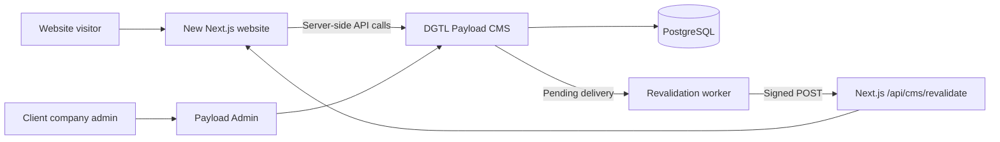

# Connecting a New Next.js Website to the DGTL CMS

For the detailed, role-by-role onboarding and maintenance process for independently hosted frontends, start with [Future Client Frontend Integration Roadmap](FUTURE_CLIENT_FRONTEND_INTEGRATION_ROADMAP.md). It includes external-repository examples, current API boundaries, deployment/QA gates, and the required shared-preview-secret trust review. Review that trust decision before copying preview credentials to a client-controlled deployment.

This guide explains how to connect an existing or new Next.js App Router website to the DGTL multi-tenant Payload CMS. It is written for the frontend, CMS, and operations developers who will onboard the next client.

The working reference implementations are:

- `apps/website` — reusable, contract-validated Client 01 frontend.
- `apps/dgtl360` — independently designed Client 02 frontend using the same CMS API.
- `packages/content-contracts` — versioned public DTO schemas.
- `packages/cms-client` — server-only typed API client.

## 1. Target architecture



There is one CMS deployment and one database for multiple tenants. Every frontend deployment is bound to exactly one `websiteKey` and uses separate read and revalidation credentials.

The browser must never call the CMS with the read token. All authenticated CMS requests must run in Server Components, server utilities, or Route Handlers.

## 2. Important content boundary

The CMS changes content; it does not automatically redesign an existing frontend.

For every editable value, the frontend developer must map a CMS field to a component prop. For example:

```tsx
const hero = findCMSBlock(cms.page, "hero");

return <HeroSection heading={hero?.heading} text={hero?.text} />;
```

If `HeroSection` still contains hardcoded text, changing the CMS will not change that text. The same rule applies to colors, images, navigation, cards, contact details, and SEO.

The current content contract supports these page blocks:

- `hero`
- `richText`
- `imageText`
- `callToAction`
- `cardGrid`
- `gallery`
- `faq`
- `contactDetails`
- `logoCloud`
- `spacer`
- `serviceIndex`
- `companyOverview`
- `statement`
- `teamShowcase`
- `serviceDetail`
- `identityField`

The DGTL360 integration also supports hero video and interface labels, ordered relationships from the homepage to service pages, team media, safe per-service accent colors, and service capability sections. Animation behavior stays in frontend code; client company admins control the content and approved design tokens that those animations present.

## 3. Decide the new client binding

Agree on these values before changing either project:

| Value                 | Example for a new client                          | Rules                                               |
| --------------------- | ------------------------------------------------- | --------------------------------------------------- |
| Tenant key            | `client-05`                                       | Unique, lowercase, stable                           |
| Website key           | `client-05-main`                                  | Unique, lowercase, stable; not a secret             |
| Display name          | `Client 05 Website`                               | May be edited later                                 |
| Production domain     | `www.client05.example`                            | Store without a scheme in the CMS `domain` field    |
| Preview origin        | `https://preview.client05.example`                | Full origin; local example: `http://localhost:3105` |
| Revalidation URL      | `https://www.client05.example/api/cms/revalidate` | Must be reachable by the CMS worker                 |
| Local frontend port   | `3105`                                            | Must not conflict with another service              |
| Content model version | `1`                                               | Must match the supported frontend contract          |

Do not rename a website key after launch. It is used in API paths, cache tags, secret maps, logs, and delivery records.

## 4. Provision the tenant and website in Payload Admin

This step requires a company administrator.

1. Open Payload Admin and select **Dgtl Tenants**.
2. Create the tenant with its unique key, display name, and `active` status.
3. Select that tenant in the Payload tenant selector.
4. Open **Websites** and create the website with:
   - `key`: the agreed website key;
   - `displayName`: the client-facing name;
   - `status`: `active` when the frontend is ready;
   - `domain`: hostname only, without `http://`, `https://`, or a trailing slash;
   - `previewDomain`: the complete local or deployed frontend origin;
   - `frontendKey`: the frontend family or repository identifier;
   - `contentModelVersion`: `1`;
   - `revalidationUrl`: the complete `/api/cms/revalidate` URL;
   - `revalidationSecretRef`: `env:CMS_REVALIDATION_SECRETS:<website-key>`.
5. Create the tenant's **Site Settings**, header and footer **Navigations**, and at least one published **Page** with slug `home`.
6. Assign one or more client company admins only to this tenant.

The multi-tenant selector helps operators choose the current tenant, but authorization is still enforced by the server. Never attempt to bypass the tenant or website fields through raw API requests.

## 5. Generate and register secrets

Generate a different high-entropy secret for reading and revalidation. Never reuse passwords, commit secrets, or send secrets in frontend JavaScript.

Example generators:

```bash
openssl rand -hex 32
```

```powershell
[Convert]::ToHexString([Security.Cryptography.RandomNumberGenerator]::GetBytes(32)).ToLower()
```

Add the new website entry to the existing JSON maps in `apps/cms/.env`. Preserve every existing client entry.

```dotenv
CMS_WEBSITE_READ_TOKENS={"client-01-main":"...","client-02-main":"...","client-05-main":"<NEW_READ_TOKEN>"}
CMS_REVALIDATION_SECRETS={"client-01-main":"...","client-02-main":"...","client-05-main":"<NEW_REVALIDATION_SECRET>"}
CMS_ALLOWED_ORIGINS=http://localhost:3101,http://localhost:3102,http://localhost:3105,https://www.client05.example
```

The frontend's `CMS_PREVIEW_SECRET` must currently equal the CMS deployment's `CMS_PREVIEW_SIGNING_SECRET`. It must be different from the read token and revalidation secret.

Restart the CMS and worker after changing CMS environment variables.

## 6. Configure the new Next.js project

Create `.env.local` in the new frontend project:

```dotenv
CMS_URL=http://localhost:3000
CMS_WEBSITE_KEY=client-05-main
CMS_READ_TOKEN=<SAME_VALUE_AS_CMS_WEBSITE_READ_TOKENS_ENTRY>
CMS_REVALIDATION_SECRET=<SAME_VALUE_AS_CMS_REVALIDATION_SECRETS_ENTRY>
CMS_PREVIEW_SECRET=<SAME_VALUE_AS_CMS_PREVIEW_SIGNING_SECRET>
NEXT_PUBLIC_SITE_URL=http://localhost:3105
```

Production uses the deployed HTTPS origins instead of localhost.

Security requirements:

- `CMS_READ_TOKEN`, `CMS_REVALIDATION_SECRET`, and `CMS_PREVIEW_SECRET` are server-only.
- Never prefix any secret with `NEXT_PUBLIC_`.
- Never place a token in a URL or log it.
- Give each website its own read and revalidation secrets.
- Rotate both sides of a credential together.

## 7. Add the content contract and CMS client

### Option A — frontend is inside this monorepo

Add the workspace packages to the frontend's `package.json`:

```json
{
  "dependencies": {
    "@dgtl/cms-client": "workspace:*",
    "@dgtl/content-contracts": "workspace:*"
  }
}
```

Add this to `next.config.ts`:

```ts
transpilePackages: ["@dgtl/cms-client", "@dgtl/content-contracts"];
```

Then run `pnpm install` from the platform root.

### Option B — frontend is in a separate repository

The two DGTL packages are currently private workspace packages and are not installable from the public npm registry. Use one of these controlled approaches:

1. Preferred for a development team: publish both packages to the company's private registry and install the same approved version in every frontend.
2. Until the private registry exists: vendor the exact source files into the frontend:
   - copy `packages/content-contracts/src/index.ts` to `src/lib/cms-contracts.ts`;
   - copy `packages/cms-client/src/index.ts` to `src/lib/dgtl-client.ts`;
   - change its `@dgtl/content-contracts` import to `./cms-contracts`;
   - install the matching validator with `pnpm add zod@4.5.4`.

Do not replace runtime contract validation with `as SomeType`. The validator prevents incompatible or wrong-website content from silently entering the UI.

DGTL360's `apps/dgtl360/src/lib/cms.ts` is a working example of a bespoke
frontend integration within this monorepo. It also demonstrates optional local
fallback content. A strict frontend should throw on a CMS failure; a fallback
frontend must log and monitor every fallback so a broken CMS connection is not
hidden.

## 8. Create the server-only CMS adapter

Create `src/lib/cms.ts`. This example assumes Option A; change imports to the vendored files for Option B.

```ts
import "server-only";

import { cache } from "react";
import { DGTLClient } from "@dgtl/cms-client";

const required = (name: string) => {
  const value = process.env[name];
  if (!value) throw new Error(`Missing required environment variable: ${name}`);
  return value;
};

export const getCMSClient = cache(
  () =>
    new DGTLClient({
      baseURL: required("CMS_URL"),
      readToken: required("CMS_READ_TOKEN"),
      websiteKey: required("CMS_WEBSITE_KEY"),
    }),
);

export const getPage = cache(async (slug: string, previewToken?: string) => {
  const client = getCMSClient();
  return client.getPage(slug, {
    draftToken: previewToken,
    next: previewToken
      ? undefined
      : {
          revalidate: 300,
          tags: [
            `cms:site:${client.websiteKey}`,
            `cms:site:${client.websiteKey}:pages:${slug}`,
          ],
        },
  });
});

export const getSiteShell = cache(async () => {
  const client = getCMSClient();
  const siteTag = `cms:site:${client.websiteKey}`;

  return Promise.all([
    client.getWebsite({ next: { revalidate: 300, tags: [siteTag] } }),
    client.getSettings({
      next: { revalidate: 300, tags: [siteTag, `${siteTag}:site-settings`] },
    }),
    client.getNavigation("header", {
      next: { revalidate: 300, tags: [siteTag, `${siteTag}:navigation`] },
    }),
    client.getNavigation("footer", {
      next: { revalidate: 300, tags: [siteTag, `${siteTag}:navigation`] },
    }),
  ]);
});
```

Fetch independent resources in parallel. Do not create a browser-side waterfall and do not expose the authenticated CMS call through a public client component.

## 9. Render CMS pages

For a generic content website, create `src/app/[[...slug]]/page.tsx`. Next.js 15 and later require `params`, `cookies()`, and `draftMode()` to be awaited.

The complete working reference is `apps/website/src/app/[[...slug]]/page.tsx`. Its flow is:

1. Convert the URL segments to a CMS slug; `/` becomes `home`.
2. Read the signed preview cookie only when Draft Mode is enabled.
3. Call `getPage(slug, previewToken)` from the Server Component.
4. Return `notFound()` when the CMS client receives HTTP 404.
5. Render `page.layout` through a block renderer.
6. Use the CMS SEO object in `generateMetadata`.

For a highly designed existing frontend, keep its routes and components. Map selected blocks into existing props, as DGTL360 does:

```tsx
const cms = await getCMSHomeContent(previewToken);
const hero = findCMSBlock(cms?.page, "hero");
const serviceIndex = findCMSBlock(cms?.page, "serviceIndex");
const contact = findCMSBlock(cms?.page, "contactDetails");
const services = orderServicePages(
  cms.servicePages,
  serviceIndex?.serviceSlugs,
);

return (
  <>
    <HeroSection content={hero} />
    <ServicesSection services={services} />
    <ContactSection content={contact} />
  </>
);
```

Create a deterministic block renderer. `apps/website/src/components/BlockRenderer.tsx` is the reference for all supported block types. Unknown block types must fail safely rather than breaking the complete page.

## 10. Configure CMS media and SEO

The CMS returns absolute media URLs under `/api/media/file/**`. Configure `next/image` using the CMS origin:

```ts
import type { NextConfig } from "next";

const cmsURL = new URL(process.env.CMS_URL ?? "http://localhost:3000");
const cmsIsLocal =
  cmsURL.hostname === "localhost" || cmsURL.hostname === "127.0.0.1";

const nextConfig: NextConfig = {
  images: {
    dangerouslyAllowLocalIP: cmsIsLocal,
    minimumCacheTTL: 86400,
    remotePatterns: [
      {
        protocol: cmsURL.protocol.replace(":", "") as "http" | "https",
        hostname: cmsURL.hostname,
        port: cmsURL.port,
        pathname: "/api/media/file/**",
      },
      {
        protocol: cmsURL.protocol.replace(":", "") as "http" | "https",
        hostname: cmsURL.hostname,
        port: cmsURL.port,
        pathname: "/api/dgtl/public/v1/sites/**",
      },
    ],
  },
  output: "standalone",
};

export default nextConfig;
```

`dangerouslyAllowLocalIP` is enabled only for the local CMS development origin. Never enable it unconditionally in production.

Use `next/image` with meaningful CMS alt text, explicit dimensions or `fill`, and a correct `sizes` value.

Map page SEO in a Server Component:

```ts
export async function generateMetadata({
  params,
}: PageProps): Promise<Metadata> {
  const { page } = await readPage(params);

  return {
    title: page.seo.metaTitle ?? page.title,
    description: page.seo.metaDescription ?? undefined,
    robots: page.seo.noIndex ? { index: false, follow: false } : undefined,
    openGraph: page.seo.ogImage
      ? {
          images: [
            {
              url: page.seo.ogImage.url,
              alt: page.seo.ogImage.alt,
              width: page.seo.ogImage.width ?? undefined,
              height: page.seo.ogImage.height ?? undefined,
            },
          ],
        }
      : undefined,
  };
}
```

## 11. Add secure draft preview

Copy and adapt these tested reference files:

```text
apps/website/src/lib/signatures.ts
apps/website/src/app/api/cms/preview/route.ts
apps/website/src/app/api/cms/preview/exit/route.ts
```

The preview flow is:

1. An authenticated client company admin requests `POST /api/dgtl/preview/v1/pages/{pageId}` from the CMS.
2. The CMS checks the user's tenant access and returns a five-minute signed frontend URL.
3. The frontend `/api/cms/preview` route validates the HMAC token and its `websiteKey`.
4. The route enables Next.js Draft Mode and stores the token in an HTTP-only cookie.
5. The Server Component sends the token to the CMS as `X-DGTL-Preview-Token` with `cache: 'no-store'`.
6. `/api/cms/preview/exit` disables Draft Mode and deletes the cookie.

Preview requirements:

- The website's `previewDomain` must point to the correct frontend origin.
- `CMS_PREVIEW_SECRET` must match `CMS_PREVIEW_SIGNING_SECRET`.
- Preview content must never use the public cached request path.
- Validate that the token's `websiteKey` matches the frontend binding before enabling Draft Mode.
- Keep the cookie HTTP-only, same-site `lax`, path `/`, and secure in production.

If Payload Admin does not show a Preview button, the API and frontend route can still be tested directly. A custom Admin control may call the authenticated preview endpoint and navigate to its returned URL.

## 12. Add signed publish revalidation

Copy and adapt these tested reference files:

```text
apps/website/src/lib/signatures.ts
apps/website/src/app/api/cms/revalidate/route.ts
apps/website/src/app/api/health/route.ts
```

The revalidation handler must:

- read the raw request body before parsing JSON;
- require `X-DGTL-Delivery-ID`, `X-DGTL-Timestamp`, and `X-DGTL-Signature`;
- reject timestamps older or newer than five minutes;
- calculate `HMAC-SHA256(secret, timestamp + "." + rawBody)`;
- compare signatures with a timing-safe comparison;
- acknowledge authenticated duplicate deliveries successfully because cache invalidation is idempotent;
- require the body `websiteKey` to equal `CMS_WEBSITE_KEY`;
- accept no more than 20 paths or tags;
- accept only tags starting with `cms:site:<website-key>`;
- reject paths that do not start with `/`, contain `..`, or contain `?`;
- call `revalidateTag(tag, { expire: 0 })` and `revalidatePath(path)` only after validation, matching the current reference handler.

The CMS worker must run continuously. Publishing creates a `Revalidation delivery`; the worker signs it and sends it to the website's configured `revalidationUrl`.

The in-memory delivery-ID map does not persist across instances or restarts. Repeating authenticated cache invalidation is safe; a durable shared receipt store is needed if stronger replay/idempotency guarantees or non-idempotent side effects are introduced. Multi-instance cache invalidation must also be coordinated by the hosting/runtime configuration.

## 13. Add a new editable component field

Every new editable field passes through four layers.

Example: editable hero background color.

1. **Payload schema** — add an approved color field to the `Hero` block in `apps/cms/src/blocks/index.ts`. Prefer a controlled select such as `light`, `dark`, and `brand`; do not allow arbitrary unsafe CSS.
2. **Public contract** — add the same field to `pageBlockSchema` in `packages/content-contracts/src/index.ts`.
3. **Public API mapping** — ensure `apps/cms/src/services/public-api.ts` includes or normalizes the field.
4. **Frontend mapping** — pass the field to `HeroSection` or map it to an approved CSS class.

Then update contract tests, frontend renderer tests, type-check both applications, and verify draft and published behavior. Increment `contentContractVersion` for a breaking change and deploy compatible frontend code before the CMS begins returning the new required shape.

## 14. Public CMS API reference

Base path:

```text
{CMS_URL}/api/dgtl/public/v1/sites/{websiteKey}
```

Required server-side headers:

```http
Accept: application/json
Authorization: Bearer <CMS_READ_TOKEN>
X-DGTL-Website-Key: <CMS_WEBSITE_KEY>
```

| Resource                | Method and path                                                     |
| ----------------------- | ------------------------------------------------------------------- |
| Website binding         | `GET /api/dgtl/public/v1/sites/{websiteKey}`                        |
| Site settings           | `GET /api/dgtl/public/v1/sites/{websiteKey}/settings`               |
| Navigation              | `GET /api/dgtl/public/v1/sites/{websiteKey}/navigation/header`      |
| Navigation              | `GET /api/dgtl/public/v1/sites/{websiteKey}/navigation/footer`      |
| Published page          | `GET /api/dgtl/public/v1/sites/{websiteKey}/pages/{slug}`           |
| Published service pages | `GET /api/dgtl/public/v1/sites/{websiteKey}/pages?template=service` |
| Clean public media      | `GET /api/dgtl/public/v1/sites/{websiteKey}/media/{mediaId}`        |

The public API returns versioned DTOs, not raw Payload documents. A normal page request returns only published, non-archived content for the authenticated website binding. Media DTOs point to the website-scoped media endpoint; it serves only records marked `public` and `clean`, supports byte ranges for video, and never serves `private-admin` files.

Wrong keys, wrong tokens, inactive websites, and inactive tenants intentionally return a not-found response without revealing which part was wrong.

## 15. Local run and connection test

Start the CMS platform:

```bash
# Terminal 1 — CMS
pnpm dev:cms

# Terminal 2 — delivery worker
pnpm dev:worker
```

Start the new frontend from its repository:

```bash
pnpm dev -- --port 3105
```

Check health:

```bash
curl http://localhost:3000/api/health
curl http://localhost:3105/api/health
```

Check the website binding from a server-side terminal. Replace the placeholders; do not paste production credentials into shell history on a shared machine.

```bash
curl \
  -H "Authorization: Bearer <READ_TOKEN>" \
  -H "X-DGTL-Website-Key: client-05-main" \
  http://localhost:3000/api/dgtl/public/v1/sites/client-05-main
```

Expected results:

1. The binding endpoint returns `contractVersion: 1` and `key: client-05-main`.
2. `/pages/home`, `/pages?template=service`, `/settings`, and both navigation endpoints return the same `websiteKey`.
3. A deliberately wrong website-key/token pairing returns 404 and never returns another client's content.
4. The frontend renders CMS content with no secrets in the browser network payload or JavaScript bundle.
5. Draft preview shows unpublished changes and displays a visible draft indicator.
6. Exiting preview returns to published content.
7. Publishing a change creates a successful entry under **Operations → Revalidation deliveries**.
8. The correct frontend changes; all other client websites remain unchanged.
9. Browser console, CMS logs, frontend logs, and worker logs contain no errors.

Run build-time verification before handoff:

```bash
pnpm typecheck
pnpm test
pnpm build
```

## 16. Troubleshooting

### Frontend says the CMS connection is not configured

One or more of `CMS_URL`, `CMS_WEBSITE_KEY`, or `CMS_READ_TOKEN` is missing. Restart the Next.js server after editing `.env.local`.

### CMS returns 404 for a known page

Check the website key/token pairing, tenant and website status, page website relationship, slug, `_status: published`, and `archivedAt`. The CMS intentionally uses 404 for invalid bindings.

### CMS returns an incompatible content contract

The frontend contract and CMS DTO version differ. Deploy a compatible `@dgtl/content-contracts` and `@dgtl/cms-client` version, or update the vendored schemas and renderer together.

### Frontend loads but content changes do not appear

Confirm that the component actually uses the CMS value. Then check:

1. the document was published, not only saved as a draft;
2. the CMS worker is running;
3. the Website record has the correct `revalidationUrl`;
4. the frontend and CMS revalidation secrets match;
5. the delivery state and safe error under **Operations → Revalidation deliveries**;
6. cache tag spelling matches `cms:site:<websiteKey>:...`.

### Preview link is invalid or expired

Check the matching preview secrets, website key, preview domain, system clocks, and five-minute expiry. Generate a new preview URL instead of reusing an expired one.

### Images fail in `next/image`

Add the CMS hostname, port, protocol, and `/api/media/file/**` path to `images.remotePatterns`. Confirm `CMS_PUBLIC_URL` is reachable by website visitors in the target environment.

### One client displays another client's content

Stop the release. Verify `CMS_WEBSITE_KEY`, token maps, page website relationships, and all DTO `websiteKey` checks. Rotate potentially exposed credentials and run the tenant-isolation suite before resuming.

## 17. Production handoff checklist

- [ ] Tenant and Website records are reviewed by a company administrator.
- [ ] Website key and domain are unique and final.
- [ ] Read, revalidation, and preview credentials match their server-side counterparts.
- [ ] No secrets use `NEXT_PUBLIC_` or exist in Git history.
- [ ] CMS-to-frontend and frontend-to-CMS network routes use HTTPS and are reachable.
- [ ] Managed PostgreSQL, backups/PITR, object storage, email/OIDC, MFA, TLS/WAF, rate limits, and monitoring are configured.
- [ ] CMS migration is reviewed and applied once; production does not use automatic schema push.
- [ ] CMS, worker, and frontend health endpoints are monitored.
- [ ] Draft, preview, publish, revalidation, rollback, and tenant-isolation tests pass in staging.
- [ ] A production build passes using the exact production environment-variable names.
- [ ] One published page, navigation, settings, SEO, and media asset are verified on the final domain.

The integration is complete only when a client company admin can change mapped content in Payload, preview and publish it on the correct website, and see only that website refresh without exposing credentials or another tenant's data.
